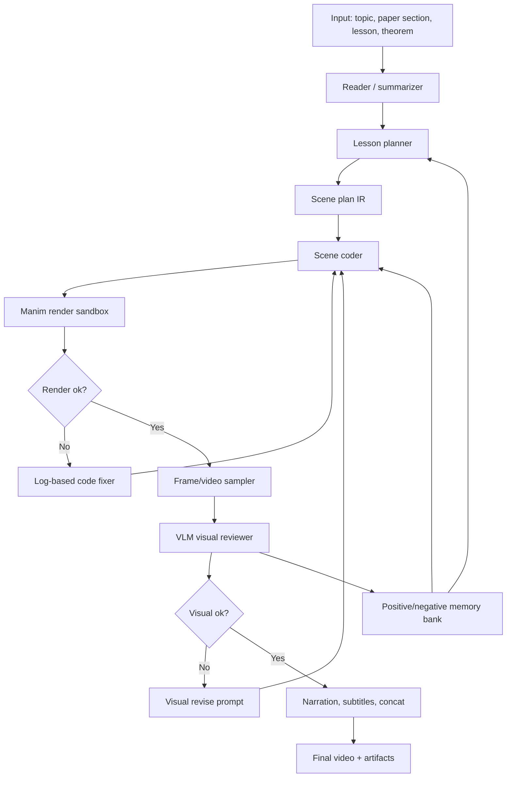

# Agentic Long-Horizon Manim Video Pipeline

Snapshot date: 2026-07-01.

This note answers the practical question: if we want an agentic pipeline that uses code-generation agents plus multimodal models to make long-horizon educational videos, what are current GitHub/arXiv systems doing, and what could we build with the data already identified in this project?

## Short Answer

Yes. There is now a small but fast-moving cluster of LLM systems doing long-horizon or text-to-code-to-video generation with Manim. The dominant pattern is not "one prompt makes a whole video". The stronger systems decompose the task:

1. parse input into a lesson/theorem/paper section,
2. plan scenes,
3. generate Manim code per scene,
4. render,
5. inspect logs and sampled frames,
6. repair with a code agent and/or multimodal reviewer,
7. concatenate scenes and optionally add narration/subtitles,
8. store successful and failed attempts as retrieval memory.

The key design decision for `4blue2brown`: avoid end-to-end video generation as the main path. Use code as the controllable substrate, add an intermediate scene-plan IR, and use VLMs mostly for critique/repair rather than raw pixel generation.

## Existing Systems

| System | What it does | Main idea to borrow | Source |
|---|---|---|---|
| TheoremExplainAgent | Generates long-form Manim videos for theorem explanations; paper says videos are over 5 minutes and benchmark covers 240 STEM theorems. | Long-horizon planning is essential; separate planning, scene code, render, evaluation, and optional RAG over Manim docs. | [arXiv](https://arxiv.org/abs/2502.19400), [GitHub](https://github.com/TIGER-AI-Lab/TheoremExplainAgent), [TheoremExplainBench](https://huggingface.co/datasets/TIGER-Lab/TheoremExplainBench) |
| ManimAgent / Paper2Manim | From scientific paper sections to Manim animations; uses self-evolving multimodal memory across tasks. | Keep a positive memory of reference successes and a negative memory of known pitfalls; use VLM keyframe review to populate both. | [arXiv](https://arxiv.org/abs/2606.30296), [project](https://manimagent.github.io/), [GitHub](https://github.com/jwj1342/Paper2Manim) |
| ManimTrainer / ManimAgent | Studies SFT, GRPO, renderer-in-the-loop, and Manim API documentation RAG for text-to-code-to-video. | Training helps Manim syntax; renderer-in-the-loop and API-doc retrieval help inference; visual rewards matter. | [arXiv](https://arxiv.org/abs/2604.18364), [GitHub](https://github.com/SuienS/manim-trainer), [ManimBench-v1](https://huggingface.co/datasets/SuienR/ManimBench-v1) |
| LLM2Manim | Human-in-the-loop STEM animation generation with constrained templates, symbol ledger, partial regeneration, and expert review. | Use pedagogical constraints: segmentation, signaling, dual coding, consistent symbol bookkeeping. | [arXiv](https://arxiv.org/abs/2604.05266) |
| ALGOGEN | Algorithm visualization via generated verifiable traces plus deterministic rendering. | Decouple "simulate concept state" from "draw it"; for algorithms, generate trace JSON first, then render. | [arXiv](https://arxiv.org/abs/2605.12159) |
| manim-generator | Practical agent harness with a Code Writer and Code Reviewer loop, LiteLLM routing, execution logs, optional vision input. | A simple writer/reviewer/render loop is a useful baseline before building sophisticated training. | [GitHub](https://github.com/makefinks/manim-generator) |
| Math-To-Manim / ManimCat / Manimator-style repos | Product/prototype repos for natural-language math animation generation. | Useful for UI and ergonomics; less reliable as research baselines unless eval data and render logs are available. | [Math-To-Manim](https://github.com/HarleyCoops/Math-To-Manim), [ManimCat](https://github.com/Wing900/ManimCat), [Manimator](https://github.com/HyperCluster-Tech/manimator) |

## Common Architecture Pattern



The important bit is that rendering is part of inference. A Manim program that does not render is a failed generation, and a Manim program that renders but overlaps labels or shows the wrong concept is also a failed generation.

## Data We Already Have

| Data source | What it gives | How to use it |
|---|---|---|
| `3b1b/videos` | Real Manim scene code, organized by year/topic | Build examples, API idiom retrieval, style primitives, compatibility/render test set |
| `3Blue1Brown.com` | Lesson metadata, article text, `video` and `source` frontmatter | Map published lessons to source paths; use text as narrative reference |
| `captions` | Transcripts, subtitles, sentence/word timing JSON for many videos | Align narration beats to visual changes; train/evaluate timing-aware planning |
| `caption_ops` | Scripts for transcription, translation, retiming | Reuse ideas for SRT/timing handling |
| Current audit TSV | 174 lessons; 143 direct source paths; 15 stale/renamed; 16 no source field | Choose golden render set and benchmark splits |
| TheoremExplainBench | 240 theorem-explanation tasks from TheoremExplainAgent | External benchmark for long-form STEM explanation planning |
| ManimBench-v1 | Manim code generation dataset from ManimTrainer | External benchmark/training seed for text-to-Manim generation |
| Our own render attempts | Plans, code, logs, frames, VLM critiques, accepted fixes | Most valuable future data because it matches our exact renderer and constraints |

Immediate golden set candidates:

| Cluster | Why |
|---|---|
| `_2024/transformers/` | Modern topic, rich diagrams, aligned with LLM explanation use case |
| `_2025/laplace/` | Recent mathematical exposition, likely less legacy compatibility pain |
| `_2026/cross_entropy/` | Recent information theory / ML-adjacent content |
| `_2017/eoc/` and `_2016/eola/` | Canonical visual grammar, but older Manim compatibility may be harder |

## Method Options

| Method | Description | Pros | Cons | When to use |
|---|---|---|---|---|
| Direct codegen baseline | Prompt a strong code model to write one Manim scene; render; fix errors. | Fast to build, good sanity check. | Breaks on long videos, weak global consistency. | Week 1 baseline. |
| Plan-then-code | Generate outline -> scene list -> per-scene code. | Better long-horizon structure and parallelism. | Scene interfaces and symbol consistency need design. | Default MVP. |
| Scene-plan IR | Require JSON/YAML with objects, formulas, beats, camera, narration spans before code. | Testable, repairable, model-agnostic. | More engineering upfront. | Best medium-term path. |
| Trace-first rendering | For algorithms/simulations, generate state traces, then deterministic Manim renderer. | Much more reliable; avoids hallucinated algorithm execution. | Less flexible for broad conceptual videos. | Algorithms, probability simulations, data transforms. |
| Retrieval-augmented coding | Retrieve Manim docs, 3b1b code examples, local style recipes. | Reduces API hallucination and style drift. | Needs chunking and retrieval hygiene. | Always, after baseline. |
| Renderer-in-the-loop | Feed render logs and traceback into fixer agent. | Large reliability gain for syntax/import/API errors. | Still blind to visual quality. | Always. |
| VLM-in-the-loop | Sample frames/keyframes; VLM checks layout, labels, concept correspondence. | Catches overlap, missing objects, wrong visuals. | VLM judges can be inconsistent; needs rubrics. | After render success. |
| Episodic memory | Store successes/failures and retrieve them for future tasks. | Improves over time without fine-tuning. | Needs validation to avoid learning bad fixes. | After we have repeated tasks. |
| SFT/GRPO | Train or adapt a smaller model on Manim examples with code+visual rewards. | Potentially cheaper and faster inference. | Requires dataset, GPU, eval harness. | Research phase, not first MVP. |

## Model Roles

Use roles instead of binding the architecture to one vendor/model:

| Role | Needed capability | Candidate model families / examples seen in current work |
|---|---|---|
| Planner | Long-context reasoning, pedagogy, math correctness | Frontier reasoning models; TheoremExplainAgent reports strong results with `o3-mini`; local/open alternatives can be tested |
| Scene coder | Python/Manim code generation, API obedience | Strong code models; ManimTrainer reports Qwen 3 Coder 30B and SeedCoder 8B as useful open-source candidates |
| Log fixer | Debug tracebacks, imports, API mismatches | Code model, lower cost acceptable |
| Visual reviewer | Frame/video understanding, layout critique, formula reading | GPT-4o/Gemini-style multimodal models; TheoremExplainAgent README requires Gemini/GPT-4o for evaluation |
| Narration writer | Clear explanation, segmentation, pacing | General strong language model, ideally with style constraints |
| Audio/TTS | Stable voice, timings, subtitles | TTS model plus alignment tooling; can initially skip voice and output scripts/SRT |
| Embedding/retrieval | Code/example/doc retrieval | Text/code embeddings; separate indexes for Manim docs, 3b1b code, failure memory |

## Proposed Pipeline for 4blue2brown

### MVP 0: Render Harness and Corpus Index

Goal: make the project know what it has.

Artifacts:

- `data/lesson_index.jsonl`: lesson metadata from website frontmatter.
- `data/source_index.jsonl`: source files/classes/functions from `3b1b/videos`.
- `data/caption_index.jsonl`: available transcript/timing files.
- render harness that can run one scene, capture logs, sample frames, and store artifacts.

Success criteria:

- Can select 10 direct-source lessons and identify source files.
- Can render at least a small recent scene or produce a structured compatibility failure report.

### MVP 1: Single-Scene Agent

Input: one concept prompt or one lesson subsection.

Pipeline:

1. Planner outputs a constrained scene plan.
2. Coder writes one Manim scene.
3. Renderer runs it.
4. Log fixer repairs until render success or budget exhausted.
5. VLM reviewer checks sampled frames with a small rubric.
6. Final artifact includes prompt, plan, code, logs, frames, video, critique.

Success criteria:

- Render Success Rate.
- No obvious overlap in key frames.
- Plan/code/video artifact is inspectable and reproducible.

### MVP 2: Multi-Scene Long-Horizon Video

Input: a topic, theorem, or paper section.

Pipeline:

1. Reader extracts key concepts and prerequisite order.
2. Lesson planner creates 3-8 scenes.
3. Symbol ledger locks notation, colors, and named objects.
4. Each scene is coded and rendered independently.
5. Global reviewer checks continuity across scenes.
6. Concatenator creates a rough video with subtitles or synthetic narration.

Success criteria:

- At least 2-3 minutes of coherent video.
- Per-scene retry budget stays bounded.
- Global symbols remain consistent.

### MVP 3: 3b1b-Derived Retrieval and Style Recipes

Use public 3b1b data as examples, carefully respecting licensing and avoiding channel/brand imitation.

Retrieval indexes:

- Manim API docs and examples.
- 3b1b source snippets, chunked by scene class and helper function.
- Article/caption beat examples, mapped to source where possible.
- Failure memory from our own renders.

Style recipes:

- coordinate transform recipe,
- formula morph recipe,
- graph plotting recipe,
- vector field recipe,
- neural network layer recipe,
- probability distribution recipe,
- attention matrix recipe,
- simulation trace recipe.

### Research-Grade Phase: Agentic Memory and Training

Once we have hundreds of attempts:

1. Store positive examples: prompt, plan, code, frames, why it worked.
2. Store negative examples: error type, bad frame, failed code, validated fix.
3. Retrieve memories by task type, API calls, visual objects, and failure signature.
4. Consider SFT on local accepted scene-plan/code pairs.
5. Consider GRPO-style training only after visual metrics are stable.

## Suggested IR

A minimal scene plan should be boring and strict:

```yaml
scene_id: attention_qk_intro
duration_sec: 35
learning_goal: Explain why query-key dot products produce an attention pattern.
symbols:
  Q: "query vector"
  K: "key vector"
visual_objects:
  - id: token_row
    type: token_sequence
    labels: ["A", "fluffy", "blue", "creature"]
  - id: score_grid
    type: matrix
    rows_from: token_row
    cols_from: token_row
beats:
  - time: [0, 8]
    narration: "Each word emits a query and a key."
    action: "show token row, then project to Q/K vectors"
  - time: [8, 20]
    narration: "A dot product measures how much one token should inform another."
    action: "animate Q dot K into score grid cells"
  - time: [20, 35]
    narration: "Softmax turns scores into attention weights."
    action: "normalize columns and highlight creature column"
checks:
  - "No label overlap."
  - "All symbols Q and K match the ledger."
  - "Final frame contains token row and attention grid."
```

This IR gives the code agent constraints, gives the VLM reviewer a checklist, and gives us a stable object for eval.

## Evaluation Stack

| Layer | Metric / check |
|---|---|
| Functional | render success, timeout rate, traceback category |
| Static code | imports, scene class exists, forbidden APIs, AST sanity |
| Visual layout | overlap, offscreen text, unreadable labels, blank frames |
| Visual semantics | requested objects present, formula meaning correct, state transitions plausible |
| Temporal | duration, pacing, no sudden blank cuts, narration-beat alignment |
| Pedagogy | segmentation, signaling, dual coding, prerequisite order |
| Reproducibility | deterministic seed, saved plan/code/logs/frames |

## Practical Recommendation

Build this in the following order:

1. `render_harness`: render a known scene and sample frames.
2. `metadata_ingester`: index 3b1b lesson/source/caption data.
3. `single_scene_agent`: plan -> code -> render -> log repair.
4. `vlm_reviewer`: frame checklist and visual revision loop.
5. `multi_scene_agent`: shared symbol ledger and scene concatenation.
6. `retrieval`: Manim docs + 3b1b snippets + own failure memory.
7. `trace_renderer`: deterministic renderers for algorithms/simulations.
8. `training`: SFT/GRPO only after the above produces enough clean attempts.

The best early bet is a hybrid of TheoremExplainAgent's long-form planning, ManimTrainer's renderer-in-the-loop/API-doc augmentation, LLM2Manim's symbol ledger and pedagogical constraints, ALGOGEN's trace/render decoupling for algorithmic content, and ManimAgent's positive/negative memory bank.
