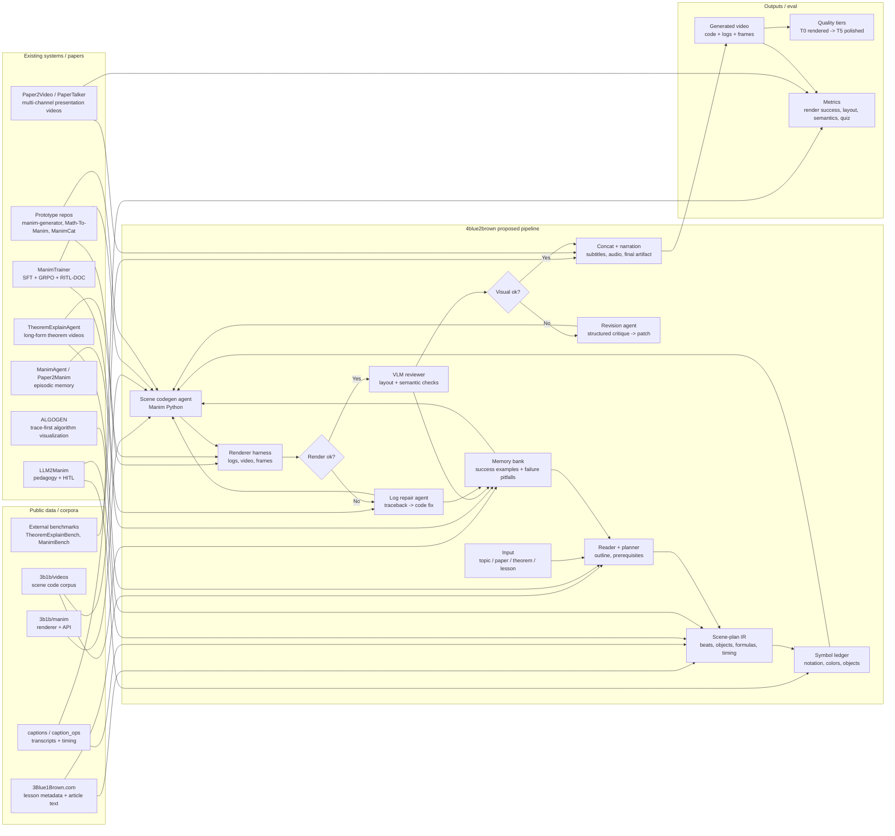
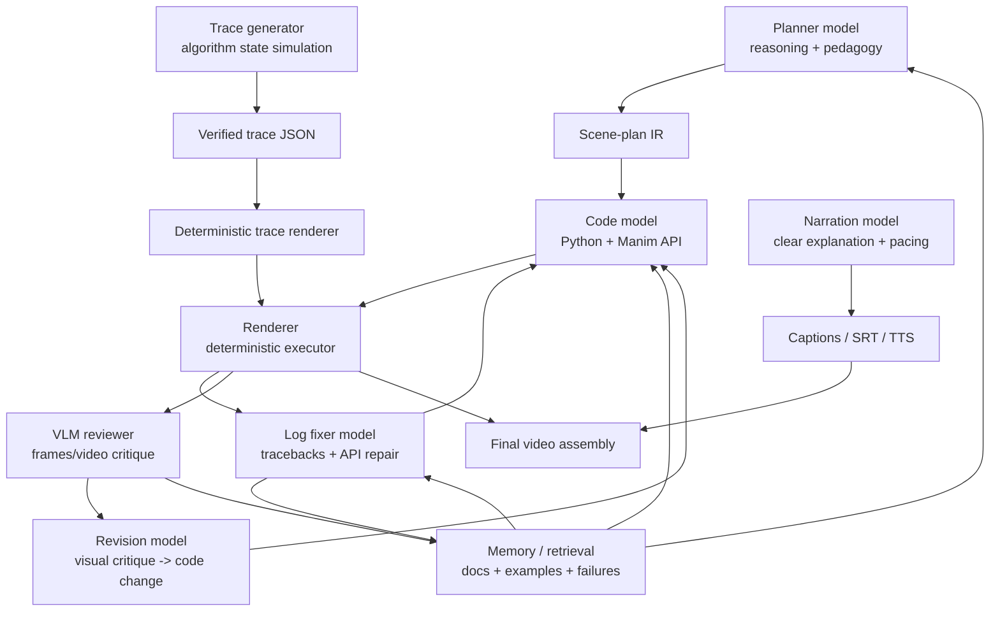
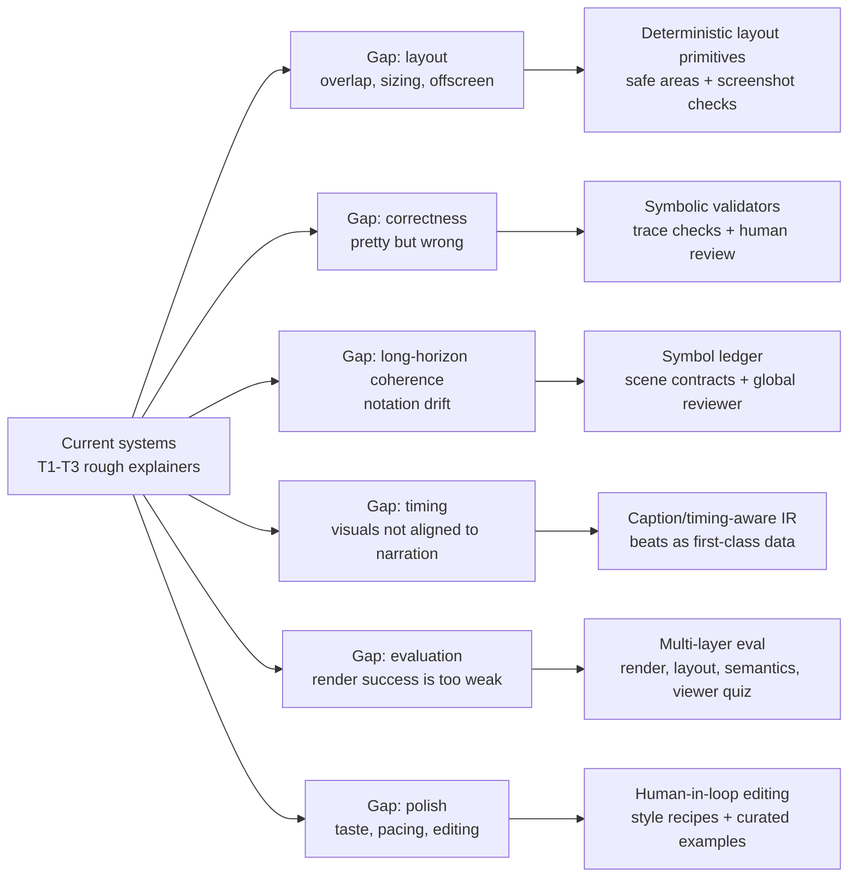

# System Map: 4blue2brown Research Landscape

Snapshot date: 2026-07-01.

这张图把目前讨论的几类东西放在一起：3b1b public data、现有 papers/repos、agentic codegen pipeline、model backbone roles、evaluation/memory，以及最终 gap。

## Big Picture

## Model Roles

## Current Gaps

## Read This Diagram As A Strategy

The relationship between the pieces is:

1. `3b1b/videos` and Manim give us the code substrate.
2. `3Blue1Brown.com` and captions give us lesson/narration/timing structure.
3. TheoremExplainAgent proves long-form Manim agents are possible.
4. ManimTrainer tells us renderer-in-the-loop and code-specialized backbones matter.
5. LLM2Manim tells us pedagogy constraints and symbol ledgers are necessary.
6. ALGOGEN tells us to decouple state simulation from rendering whenever possible.
7. ManimAgent/Paper2Manim tells us memory should be split into successes and known pitfalls.
8. Our pipeline should turn all of this into a measurable loop before trying fine-tuning.
