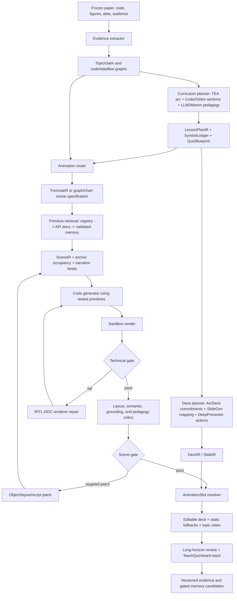

# Integrated Slides + Manim Pipeline and Backtranslation Loop

Status: proposed execution design; interfaces below require versioned schemas before implementation

Last updated: 2026-07-16

Stable parent contract: [Paper Media Pipelines: Stable Design](paper-media-pipelines.md)

Evidence reviewed for this design:

- [Agentic long-horizon pipeline survey](../../AGENTIC_PIPELINE.md)
- [Math-paper explainer framework survey](../research/math-paper-explainer-frameworks.md)
- [Paper-to-slides landscape](../research/auto-slides-generation-landscape.md)
- [Four-family reproduction notes](../experiments/reproduction-suite-transformers-feynrl-rope.md)
- [Bottom-up formula explainer v0](../experiments/bottom-up-formula-explainer-v0.md)
- [Slides + Manim smoke contract](../../experiments/slides_manim/README.md)
- [Backtranslation v1 protocol](../../experiments/backtranslation/v1/README.md)

## 1. Decision

The main pipeline should not copy any one upstream system end to end. Its stable
spine is our typed evidence graph and `FormulaIR -> SceneIR -> SlideIR` path.
Upstream systems contribute replaceable policies around that spine:

| Source | Capability to adopt | Boundary |
| --- | --- | --- |
| Paper2Manim / ManimAgent | Paper parsing, storyboard fan-out, per-scene render/review loops, best-of-N selection, and separately retrieved success/failure memory | Do not import unreviewed cross-task memory or treat a VLM exception as a pass. |
| Code2Video | Executable Manim as the substrate, lecture sectioning, coder/critic split, anchor-grid occupancy, and TeachQuiz-style knowledge-transfer evaluation | Its native input is a knowledge point, not a paper and repository. Paper/code grounding remains ours. |
| TheoremExplainAgent (TEA) | Long-horizon outline, vision storyboard, technical implementation, narration planning, scene concurrency, subtitles, and chunked evaluation | Its theorem/topic plan is an input to our typed IR, not an alternative evidence model. |
| LLM2Manim | Symbol ledger, segmentation, signaling, dual coding, partial regeneration, and human review | This is a method-level lesson in the current repo, not a locally verified official implementation. |
| ManimTrainer / ManimAgent | Renderer-in-the-loop repair and AST-guided lookup of exact Manim API documentation | API documentation repairs syntax and signatures; it does not establish semantic correctness. |
| DeepPresenter | Reference-deck analysis, edit actions, environment-grounded page reflection, and presentation QA | Current local evidence is preflight only, not a generated deck. |
| SlideGen | Paper-specialized outliner, formula/figure mapper, arranger, speaker-notes writer, and refiner | Current local evidence is native PDF parsing only, not a generated deck. |
| ArcDeck | Audience/duration-conditioned discourse tree and explicit narrative commitments | Its visual backend has SlideGen ancestry and its packaging is experimental; use its planning idea, not an independence claim. |

The resulting system has one planner, two coordinated render targets, and one
joint evaluator. Slides provide the editable long-horizon narrative. Manim is
reserved for content whose meaning depends on state change, geometry, formula
operations, dataflow, or comparative dynamics.

## 2. Architecture



The animation router is essential. It prevents the deck generator from asking
Manim to animate every slide and prevents the video planner from replacing
editable citations, tables, and prose with unnecessary motion.

| Slide intent | Default medium | Animation trigger |
| --- | --- | --- |
| Motivation / related work | Static slide | Only when a causal contrast cannot be understood statically. |
| Methodology / equation | Formula card plus static terminal state | Use FormulaIR when intermediate operations carry the explanation. |
| Architecture / dataflow | Editable graph | Use SceneIR when tokens, tensors, samples, or policies move through states. |
| Performance / ablation | Editable chart and source table | Use a deterministic chart/comparison primitive when the transition or trade-off is the claim. |
| Summary | Static recap and self-check | Reuse short clips only; do not introduce a new animation. |

## 3. Contracts passed between stages

These are logical contracts. They should become new schemas or versioned
extensions rather than optional dictionaries passed between agents.

### 3.1 SourcePacket

The evidence extractor emits `SourcePacket/0.1.0`:

- immutable paper, repository, figure, table, and data snapshot IDs and hashes;
- license and publication policy;
- claim nodes with exact section/equation/figure locators;
- formula candidates and code/dataflow candidates;
- confidence and review state for every mapping;
- canonical family, audience, target duration, and allowed external assets.

Gate: a claim cannot enter planning without a source locator. A code edge marked
`candidate` may be shown as candidate but cannot silently become `confirmed`.

### 3.2 LessonPlanIR, SymbolLedger, and QuizBlueprint

The curriculum planner emits three linked artifacts:

`LessonPlanIR/0.1.0` contains:

- one learning objective and one misconception per micro-lesson;
- a prerequisite DAG and TEA-style long-horizon scene order;
- Code2Video-style lecture sections and visual commitments;
- slide intent and animation need for each commitment;
- source claim refs, FormulaIR candidates, code/dataflow refs, and expected recap;
- a bounded duration and retry budget per unit.

`SymbolLedger/0.1.0` contains:

- stable symbol ID, rendered form, spoken form, semantic type, and scope;
- aliases used by the paper and repository;
- fixed color/style token and accessibility label;
- paper, formula, and code refs;
- first definition and every consuming scene/slide.

`QuizBlueprint/0.1.0` contains, before code generation:

- prerequisite question;
- one claim-recall item;
- one mechanism or counterfactual item;
- expected answer with source refs;
- misconception targeted by each distractor;
- a flag separating model-student, human-review, and future human-study use.

Gate: symbol collisions, undefined symbols, a scene without a testable learning
goal, or a quiz answer without source evidence block downstream generation.

### 3.3 FormulaIR and SceneIR v0.2 requirements

The current `formula-ir/0.1.0` correctly represents atoms, an operation DAG,
source anchors, and code mappings. The next version must add:

- `symbol_ledger_ref`, assumptions, named intermediate values, and units/shapes;
- learning goal, misconception, and reviewed numeric fixture;
- claim/evidence refs and review refs for formula-to-code mappings;
- operation-level constraints used to judge semantic equivalence.

The current `scene-ir/0.1.0` is a valid clip-plan smoke contract, but it contains
generic one-second beats and no object/layout model. The next version must add:

- stable visual object IDs linked to symbols, operations, code, or data;
- anchor-grid region, safe-area bounding box, z-order, minimum text size, and
  collision policy for every object;
- camera, narration, subtitle, and state-transition timing;
- expected visible evidence at sampled checkpoints;
- quiz and misconception refs;
- permitted patch scopes: `code`, `object`, `layout`, `timing`, or `script`.

Gate: the planner must reject a critical operation mapped only to
`missing_planned`. A `generated_one_off` primitive may run in a development
scene but cannot be presented as reusable.

### 3.4 PrimitiveQuery and retrieval result

For each SceneIR operation, the selector receives:

```text
operation type + semantic shapes + desired state transition
+ target aspect/region + renderer version/dependencies
+ source/license constraints + known failure signature
```

Retrieval order is deterministic:

1. exact compatible entry in `data/formula_explainer/primitive_registry.json`;
2. composable project primitives with passing tests and golden-scene refs;
3. AST-extracted Manim calls and exact API documentation, following
   ManimTrainer's RITL-DOC idea;
4. validated positive examples and negative repair recipes from a frozen memory
   snapshot;
5. a scoped one-off implementation, labeled `generated_one_off`.

The result records candidate ID/version, origin, operation coverage, renderer
compatibility, transitive dependencies, license, test/golden refs, retrieval
score, rejection reasons, and memory snapshot hash.

Gate: a missing dependency, untested reusable primitive, incompatible Manim
version, or unresolved license fails selection. The `BarChart -> MathTex ->
LaTeX` Babel failure proves that direct Manim provenance alone is insufficient;
transitive dependencies are part of compatibility.

### 3.5 RenderAttempt and repair request

Every render attempt records:

- SourcePacket, LessonPlanIR, FormulaIR, SceneIR, primitive-registry, prompt,
  model, and environment hashes;
- exact code, sandbox policy, command, timeout, stdout/stderr, exit state, media
  probe, frame samples, cost/usage, and parent attempt;
- AST-extracted Manim calls and hashes of any API documentation returned;
- patch scope and changed object/beat IDs.

Repair is ordered and bounded:

1. static/code-safety failure: no execution;
2. compile/import/API failure: RITL-DOC may patch code only;
3. runtime/timeout/media failure: renderer repair may patch code or primitive;
4. layout failure: patch object anchors/sizes before regenerating the scene;
5. semantic/grounding failure: patch the plan or script, then rebuild SceneIR;
6. pedagogy failure: return to LessonPlanIR, not to a free-form code fixer.

Each loop has a separate cap. A renderer exception, missing frame sample, VLM
parse error, or evaluator timeout is `error`/`not_run`, never automatic pass.

### 3.6 DeckIR, SlideIR, and AnimationSlot

The deck planner combines:

- ArcDeck-style discourse commitments and audience/duration constraints;
- SlideGen-style formula/figure mapping, arrangement, notes, and refinement;
- DeepPresenter-style reference-deck tokens, edit actions, rendered-page
  reflection, and environment-grounded repair.

A new `DeckIR/0.1.0` should hold the narrative graph, template tokens, slide
order, global citations, symbol ledger, duration, and deck-level review. Each
SlideIR remains the independently editable page contract.

The existing `AnimationSlot` contract remains the fusion gate: a resolved slot
requires a validated SceneIR, rendered video, poster/static fallback, captions,
hashes, and lineage. Missing methodology, architecture, or performance scenes
stay `planned_missing`; dummy media cannot resolve a slot.

## 4. Failure gates

| Gate | Required pass | Failure route |
| --- | --- | --- |
| G0 Source integrity | Snapshot hashes, locators, license, allowed inputs | Stop the cell; do not let the planner invent a replacement source. |
| G1 Lesson integrity | Prerequisite DAG, one goal/misconception/quiz per unit, consistent symbol ledger | Return to curriculum planner. |
| G2 Primitive integrity | Operation coverage, compatible environment, dependencies, verification refs | Retrieve another primitive or create labeled one-off development code. |
| G3 Execution safety | AST policy, external sandbox, timeout, valid media | RITL-DOC within fixed attempts; otherwise fail/partial. |
| G4 Layout | Deterministic safe-area, overlap, font-size, crop, anchor occupancy checks; then VLM review | Patch anchors/objects; VLM failure cannot override deterministic failure. |
| G5 Semantic grounding | Expected objects/events, formula invariants, claim/code/data refs | Replan affected SceneIR/FormulaIR. |
| G6 Fusion | Static fallback, citations, slot hashes, slide readability with playback off | Keep slot `planned_missing` or slide `partial`. |
| G7 Long-horizon learning | Symbol/claim continuity, recap coverage, quiz/teach-back result | Return to LessonPlanIR; do not repair only the final frame. |
| G8 Publication | Completion derived by contract, review event, cost reconciliation, public projection | Preserve private artifacts but do not publish a success claim. |

Passing an earlier gate does not imply passing a later one. In particular,
render success is not layout, semantic, pedagogical, deck, or benchmark success.

## 5. Backtranslation-driven improvement

### 5.1 What backtranslation can and cannot teach

The ten pinned Manim Community scenes are a public development set. They can
measure and improve:

- primitive/API retrieval;
- object/state/animation planning;
- compile/runtime repair;
- anchor, collision, crop, timing, and camera evaluation;
- the video-ingestion and checkpoint-sampling mechanics used by learner eval.

They cannot establish paper faithfulness or knowledge transfer because they do
not carry our paper claims, learner objectives, or validated quiz answers.
Backtranslation must not tune TeachQuiz answer keys or become a paper benchmark.

### 5.2 Frozen condition protocol

For each `bt-001` through `bt-010`:

1. Render the pinned official source as the human/reference condition.
2. Give one-shot generation only normalized `reference.mp4`; source and scene
   metadata remain hidden.
3. Initialize self-refinement from the exact one-shot code hash.
4. Allow at most three revisions using only the versioned feedback policy.
5. Preserve every code/render/feedback hash and failure in the denominator.
6. Run post-condition analysis only after the one-shot/self-refined traces are
   closed. Post-condition inspection must never leak into an active condition.

The existing pixel/duration thresholds remain valid for strict reconstruction.
They must not be reused as quality thresholds for paper explainers, where a
semantically better design can be visually different.

### 5.3 Residuals and module-specific updates

After conditions close, derive five typed residual streams:

| Residual | Computed from | Candidate update | Promotion evidence |
| --- | --- | --- | --- |
| `primitive_retrieval_residual` | Required operations/API calls versus selected candidates, render failures, and post-run official-source audit | Registry tags, compatibility/dependency facts, retrieval ranker, or new primitive | Resolves at least two development cases, or one case plus a dedicated regression; test and golden scene required. |
| `scene_plan_residual` | Object/event tracks, state ordering, duration, and camera deltas | Scene templates, object-state constraints, timing policy | Improves held-back development cases without new semantic/layout regressions. |
| `renderer_repair_residual` | Sanitized failure category and validated before/after code transition | RITL-DOC recipe or static check | Exact failure reproducer plus passing repaired render; no source-scene identifiers. |
| `layout_eval_residual` | Anchor occupancy, bounding boxes, text size, crop, frame diffs, and VLM disagreement | Deterministic layout thresholds or critic rubric | Lower false-pass and false-fail rate on labeled dev frames; evaluator error stays non-pass. |
| `learner_eval_mechanics_residual` | Whether relevant visual events were sampled and visible to the model-student | Sampling cadence, checkpoint selection, subtitle/video packaging | Better event capture on gallery dev scenes only; no change to paper quiz content or correctness thresholds. |

The update loop is:

```text
frozen backtranslation run
  -> typed residuals
  -> quarantined MemoryCandidate
  -> regression/golden tests
  -> policy or human review
  -> versioned primitive/planner/repair/evaluator release
  -> frozen memory snapshot
  -> paper demo run
```

### 5.4 Memory quarantine and promotion

Use separate stores, never one undifferentiated RAG index:

| Store | Contents | May enter paper generation? |
| --- | --- | --- |
| `bt_raw` | Reference/source audit, scene IDs, exact generated code, frames, and per-case feedback | No. |
| `bt_candidates` | Generalized failure hypotheses with raw provenance refs | No. |
| `primitive_verified` | Versioned APIs with tests, golden scenes, dependencies, and license | Yes, through a frozen snapshot. |
| `repair_verified` | Reproducible error signature and validated minimal repair | Yes, with scene identifiers and exact reference code removed. |
| `layout_verified` | Reviewed thresholds and anchor recipes | Yes, through a frozen evaluator version. |
| `pedagogy_dev` | Paper-dev misconceptions, toy examples, and learner results | Only for later development runs, never the evaluation split that produced them. |

A backtranslation-derived record is promotable only when it:

1. is expressed in operation/API/layout terms, not a scene name or exact frame;
2. carries all raw provenance privately;
3. passes a reproducer and a non-source regression;
4. demonstrates improvement with no gate regression;
5. receives a structured review event;
6. produces a new version and content hash.

Before paper runs, freeze the primitive registry, planner prompts/policies,
repair store, layout evaluator, learner evaluator, model versions, and all hashes.
No result from one paper cell may modify another cell in the same comparison.

## 6. Minimal four-family experiment

These are integration demos on known project topics, not a held-out benchmark.
After iterative work on them, they must continue to be labeled a development or
showcase set. A later research claim needs separate paper families frozen before
pipeline development.

### 6.1 Scope

| Family | Minimal explanatory unit | Required grounding | Required slide/video output | Quiz mechanism |
| --- | --- | --- | --- | --- |
| Transformers | Scaled dot-product attention followed by softmax; multi-head fan-out may remain a declared missing extension | Eq. (1), Q/K/V shapes, attention output, source locator | One methodology slide, one FormulaIR clip, one static fallback | Predict how increasing one score changes its weight and weighted output. |
| DPO | Chosen/rejected policy-reference margin and log-sigmoid objective | Eq. (7), symbol ledger for policy/reference/chosen/rejected | One methodology/comparison slide and one formula clip | Explain why the reference term changes the preference margin. |
| FeynRL | Normalized ESS followed by the paper-adopted P3O objective | Eqs. (11)-(12), reviewed five-sample fixture, candidate code refs clearly labeled | Two linked methodology slides, ESS clip, P3O clip, short topic composition | Predict ESS when one ratio dominates and connect it to the score cap. |
| RoPE | Paired rotation and the relative-position attention identity | Eq. (16), vector shapes, position difference | One methodology/geometry slide and one rotation clip | Predict which positional quantity remains in the Q/K inner product. |

Every output must include citations, speaker notes, a static fallback, poster,
captions, hashes, lineage, cost state, and gate results. A full editable deck is
not required for this first experiment; claiming one would overstate scope.

### 6.2 Three frozen arms

Run the same model/provider, 854x480/15 fps render target, budget, retry caps,
source snapshots, and review policy in all arms:

| Arm | Configuration | Purpose |
| --- | --- | --- |
| A | Current FormulaIR/SceneIR v0 compiler and existing primitive registry; no learned memory | Reproducible project baseline. |
| B | Integrated planner, symbol ledger, slide commitments, deterministic anchors, RITL-DOC, and joint gates; no backtranslation-derived promoted records | Measures the architecture change. |
| C | Exact Arm B plus one pre-frozen promoted backtranslation snapshot | Measures whether generalized backtranslation lessons transfer. |

This is 12 formula/topic-level cells. Do not multiply cells by the number of
clips or slides. Run in two phases:

1. cheap plan/static validation for all 12 cells;
2. render only cells passing G0-G2, preserving failed/preflight cells in the
   denominator.

### 6.3 Measurements and stop rules

Primary measurements:

- G0-G8 pass/error/not-run vector;
- render success and attempts to first valid render;
- deterministic overlap/offscreen/minimum-font violations;
- source-supported claim coverage and symbol-ledger violations;
- operation and expected-event coverage;
- AnimationSlot/static-fallback completion;
- model-student quiz gain relative to text-only and no-content controls;
- wall time, provider calls, measured/estimated cost, and institutional compute.

Secondary measurements:

- VLM layout/logic/accuracy rubric with raw responses retained;
- human quick review of the twelve terminal artifacts;
- targeted-patch size and whether later revisions regress an earlier best
  rendition.

Stop a cell when any hard budget is exceeded, a source/safety/license gate
fails, or the bounded repair loops are exhausted. Preserve the best passing
rendition, not automatically the latest one. Unknown cost or evaluator failure
cannot be converted to zero or pass.

## 7. Exact insertion points in the current repository

| Current seam | Change to implement next | Contract consumed/emitted |
| --- | --- | --- |
| Before `tools/formula_explainer/compiler.py::build_all` | Add evidence extraction and curriculum planning instead of relying only on hand-authored formula files. | `SourcePacket -> LessonPlanIR + SymbolLedger + QuizBlueprint` |
| `schemas/formula-explainer/formula-ir-0.1.0.schema.json` | Add the v0.2 fields in Section 3.3; do not silently relax v0.1. | `FormulaIR/0.2.0` |
| `tools/formula_explainer/compiler.py::compile_scene` | Replace generic fixed-duration beats with a planner that resolves object states, primitives, anchors, narration, and expected checkpoints. | `FormulaIR + LessonPlanIR + PrimitiveQuery -> SceneIR/0.2.0` |
| `data/formula_explainer/primitive_registry.json` and its validator | Add transitive dependencies, compatibility ranges backed by renders, retrieval tags, and promotion review refs. | versioned primitive snapshot |
| Between SceneIR validation and `scenes/formula_explainer_scene.py` | Add code generation plus static/sandbox checks; the current generic renderer remains the deterministic Arm A compiler. | `SceneIR -> RenderAttempt` |
| After every failed render | Add ManimTrainer-style AST API extraction and RITL-DOC within a fixed code-only repair cap. | `RenderAttempt -> RepairRequest -> child RenderAttempt` |
| After valid media | Add Code2Video-style anchors/occupancy plus deterministic geometry checks before VLM review. | `RenderAttempt -> LayoutEvaluation` |
| `schemas/slides-manim/slide-ir-0.1.0.schema.json` | Introduce DeckIR and link slide commitments, symbol ledger, quiz refs, and deck-level continuity without weakening current artifact evidence. | `LessonPlanIR -> DeckIR -> SlideIR/0.2.0` |
| `tools/slides_manim/validation.py` | Retain its fail-closed artifact/hash checks and add G6 semantic-region and static-readability checks. | `SlideIR + SceneIR + artifacts -> resolved AnimationSlot` |
| `tools/backtranslation/*` after a condition trace closes | Add post-condition residual exporters and quarantine; do not alter the frozen v1 feedback path. | `ConditionTrace -> typed residuals -> MemoryCandidate` |
| New `tools/integrated_pipeline/` coordinator | Orchestrate hashes, gates, retry caps, best-of-N, cost reservation, and canonical evidence. | all contracts -> canonical run/artifact records |

## 8. Known contract gaps and likely bugs to avoid

1. The stable design describes richer FormulaIR/SceneIR fields than the current
   v0.1 schemas enforce. Treat this as a versioned contract gap, not as fields
   agents may improvise.
2. `compile_scene` currently creates generic one-second operation beats. Those
   clips prove the build path, not pedagogy, timing, or long-horizon planning.
3. A visual-review exception must not auto-pass. Upstream soft-fail behavior is
   useful for keeping a pipeline alive but is invalid for our publication gate.
4. Pixel similarity at `0.99` is intentionally strict for backtranslation and
   inappropriate for semantically equivalent paper explanations.
5. Backtranslation exact code, scene names, and frames must never enter the
   general paper-generation retrieval store.
6. A successful latest revision may be worse than an earlier one. Preserve and
   publish the highest version that passes all required gates.
7. SlideGen, DeepPresenter, and ArcDeck strengths in this document are design
   inputs. Current local runs do not yet prove full generated-deck quality.
8. The four familiar papers are already development subjects. Iterative gains on
   them are product evidence, not unbiased generalization evidence.

## 9. Implementation order

1. Define `SourcePacket`, `LessonPlanIR`, `SymbolLedger`, `QuizBlueprint`, and
   `DeckIR`; version FormulaIR and SceneIR without changing v0.1 artifacts.
2. Implement deterministic primitive retrieval and dependency-aware compatibility.
3. Add object anchors/layout checks and bounded RITL-DOC repair.
4. Run and close the ten backtranslation conditions; export quarantined residuals.
5. Promote only tested, generalized records and freeze snapshot v1.
6. Run Arms A/B/C across the four-family development matrix.
7. Resolve passing scenes into SlideIR AnimationSlots and run joint deck/video
   evaluation.
8. Only after the interfaces stabilize, reserve new papers as a held-out
   benchmark and pre-register its memory/model/evaluator snapshots.
