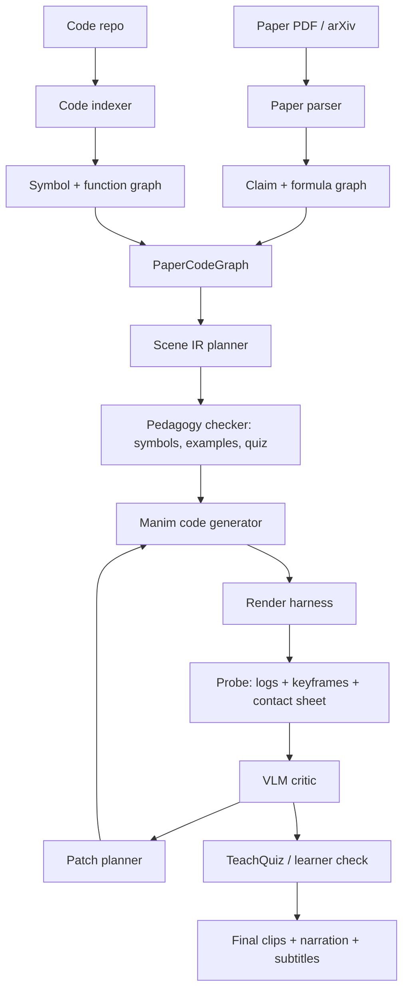

# Paper-to-Manim Agent Implementation Notes

Snapshot date: 2026-07-07.

This note records the current implementation pass for a paper-with-code educational video pipeline. The goal is not to train a new model yet; it is to evaluate existing agent/codebases, run a small robust baseline, and converge on an in-house design.

## Executive Summary

We now have a concrete local v0 that renders three short Manim videos and evaluates them with both deterministic video probes and a real multimodal WInE critic on Babel.

The three generated topics are:

| Topic | Scene class | Duration | VLM score | Current judgment |
|---|---|---:|---:|---|
| FeynRL / P3O / ESS | `FeynRLESSMiniLesson` | 14.27s | 3/5 | Renderable storyboard; does not yet teach the ESS mechanism deeply. |
| DPO | `DPOPreferenceExplainer` | 11.73s | 4/5 | Clearest storyboard; needs symbol definitions and beta/reference-policy explanation. |
| Scaled dot-product attention | `AttentionSoftmaxExplainer` | 11.40s | 3/5 | Good high-level flow; needs actual QK dot-product and softmax transformation. |

The important finding is that "Manim render succeeds" is a very weak success criterion. A video can be visually clean and still fail pedagogically. The evaluator loop needs to check pacing, symbol grounding, worked examples, formula-code alignment, and whether a learner can answer a post-video question.

## External Codebases Checked

| Codebase | What it is | Fit for our goal | Codebase quality notes | Main gap |
|---|---|---|---|---|
| [TheoremExplainAgent](https://github.com/TIGER-AI-Lab/TheoremExplainAgent) | ACL 2025 oral system for theorem-to-long-form Manim explanations. It includes generation, evaluation, RAG/context learning options, and baseline video data. | Good for theorem/concept explanation and long-form Manim generation. Less directly suited to paper+code explanation. | Research repo, reasonably complete CLI, but dependency-heavy: Python 3.12, Manim/LaTeX stack, Kokoro TTS, LiteLLM-style model config, video eval setup. | It does not solve formula-code-example grounding for an implementation repo like FeynRL. |
| [Code2Video](https://github.com/showlab/Code2Video) / [paper](https://arxiv.org/abs/2510.01174) | ICML 2026 code-centric educational video generation framework. Planner, Coder, Critic agents generate executable Manim code; evaluation includes aesthetics and TeachQuiz. | Very relevant for concept-to-video and VLM feedback loops. | Clean, focused research repo. Uses Manim Community v0.19.0 and custom API config. Easier to adapt to WInE than to direct Bedrock. | Starts from a knowledge point, not a full paper+code repo; API layer needs patching for our provider routing. |
| [Paper2Manim](https://github.com/jwj1342/Paper2Manim) / ManimAgent-style repo | Paper-section-to-Manim system with role-based model routing, render fixer, visual reviser, vision checker, and memory-bank direction. | Closest to our desired paper-to-video direction. | Young but thoughtfully structured. Python 3.11/3.12, Manim 0.20.1, LangGraph/LangChain, provider config with `openai_compatible` and `anthropic`. | Needs hardening and provider config for Babel/WInE; direct Bedrock support is not native. |
| [LLM2Manim](https://arxiv.org/abs/2604.05266) | Pedagogy-aware human-in-the-loop LLM-to-Manim pipeline with symbol ledger, segmentation, and educational evaluation. | Very useful design reference for pedagogy and evaluation. | Paper-first reference; not yet treated here as runnable code. | HITL and classroom eval ideas need to be translated into an automated agent pipeline. |
| [Manimator](https://arxiv.org/abs/2507.14306) | Paper/prompt to explanatory Manim animations via scene description and code generation. | Useful as a minimal two-stage baseline. | Conceptually simple. | Less evidence of robust render/eval loop than Code2Video/Paper2Manim. |
| [PhysicsSolutionAgent](https://arxiv.org/abs/2601.13453) | Physics explanation videos with Manim, automated checks, and VLM feedback. | Good evaluation reference for long educational videos. | Useful for metric design: video-completion rate, automated score, VLM feedback, human inspection. | Domain-specific to physics problems, not paper-with-code. |

## Babel and API Status

Babel working directory used in this pass:

```text
$HOME/4blue2brown_explore
```

What works:

| Check | Status |
|---|---|
| SSH to Babel | Works. |
| Existing Python env | `$HOME/voice_coding_agent_runs/envs/voice-code/bin/python`, Python 3.9.21. |
| WInE text API | Smoke tested successfully with `wine-claude-haiku-4-5`. |
| Bedrock text API | Smoke tested successfully with `amazon.nova-lite-v1:0`. |
| WInE multimodal review | Works with `wine-gemini-2.5-flash` when `max_tokens` is high enough. |
| Secret handling | The reviewer now parses multi-line `NAME=value` key files and avoids leaking invalid header content. |

What is not yet installed on Babel:

| Missing piece | Impact |
|---|---|
| Dedicated Manim render env | External repos cannot be rendered robustly on Babel yet. |
| Python 3.11/3.12 project env | Paper2Manim and TheoremExplainAgent want newer Python than the current voice env. |
| LaTeX/ffmpeg/full render dependencies check | Needed for production Manim runs, especially MathTex-heavy scenes. |
| Provider patches for external repos | Paper2Manim is easiest via `openai_compatible`; Code2Video needs custom API config edits; TEA uses LiteLLM naming. |

API routing recommendation:

| Role | Default | When to switch |
|---|---|---|
| Planning / summarization | WInE Claude Haiku/Sonnet | Use Bedrock when running more than about 100 calls or batch sweeps. |
| Code generation | Strong WInE Claude/Qwen or Bedrock Qwen/Claude | Use strongest model for Manim code and repair; failures are expensive. |
| Visual critique | WInE Gemini with high `max_tokens`, or Bedrock vision model if configured | Gemini on WInE spends many hidden reasoning tokens; budget accordingly. |
| Cheap scoring / rubric passes | Bedrock Nova/Haiku-style model | Good for large eval batches. |

## What We Implemented

New/updated files:

| File | Purpose |
|---|---|
| `scenes/inhouse_paper_explainer_suite.py` | Three robust Manim Community scenes for FeynRL/P3O, DPO, and attention. Avoids LaTeX for portability. |
| `tools/probe_rendered_videos.py` | Uses ffprobe/ffmpeg/PIL to extract frames, build contact sheets, and compute brightness/non-background/entropy checks. |
| `tools/vlm_render_review.py` | Optional multimodal reviewer for mock, WInE/OpenAI-compatible, or Bedrock Converse providers. |
| `tools/run_inhouse_video_suite.py` | One-command harness for the current suite: render, probe, and optionally run VLM review. |
| `data/inhouse_paper_video_specs.json` | Machine-readable registry of the three current video cases and their next edits. |

Rendered videos:

| Topic | Local video |
|---|---|
| FeynRL / P3O | `runs/inhouse_manim_media/videos/inhouse_paper_explainer_suite/480p15/FeynRLESSMiniLesson.mp4` |
| DPO | `runs/inhouse_manim_media/videos/inhouse_paper_explainer_suite/480p15/DPOPreferenceExplainer.mp4` |
| Attention | `runs/inhouse_manim_media/videos/inhouse_paper_explainer_suite/480p15/AttentionSoftmaxExplainer.mp4` |

Review artifacts:

| Artifact | Path |
|---|---|
| Probe report | `runs/inhouse_eval/probe_report.md` |
| Contact sheets | `runs/inhouse_eval/contact_sheets/*.png` |
| WInE VLM reviews | `runs/inhouse_eval/vlm_reviews/*.wine.json` |

Current one-command local rerun:

```bash
./.venv-arm64/bin/python tools/run_inhouse_video_suite.py --review-provider mock
```

For real WInE review, run the same script in an environment with WInE credentials or use the Babel copy under `$HOME/4blue2brown_explore`.

## Agentic Eval Loop Run

The loop used in this pass:

1. Generate deterministic Manim scenes.
2. Render videos locally at low quality for fast iteration.
3. Probe videos with ffmpeg/PIL and build contact sheets.
4. Inspect contact sheets manually.
5. Patch scene pacing after detecting that DPO's third sample frame landed in a transition.
6. Re-render and re-probe.
7. Run WInE multimodal critic on Babel over the contact sheets.
8. Record critic outputs as structured JSON.

The DPO probe illustrates why this matters. Before pacing edits, the third sampled frame had `non_background_fraction=0.0105`, meaning the evaluator caught a mostly blank/faded transition. After the edit, it rose to `0.0307`, and the final content became visible in the contact sheet.

## Video Quality Notes

| Topic | What the video is like | What it can do | What it cannot do yet |
|---|---|---|---|
| FeynRL / P3O | Three-beat storyboard: problem/signal/control, ESS toy table, P3O objective pieces. | Makes the existence of ratios, ESS, and adaptive loss pieces visible. | It does not yet derive ESS, connect to FeynRL code lines, or explain why low ESS should change gradient trust. |
| DPO | Preference pair to log-ratio objective to RLHF-vs-DPO route. | Best current "first watch" intuition. | It assumes the viewer already knows `pi`, reference policy, beta, chosen/rejected, and sigmoid loss. |
| Attention | Q/K/V cards, attention weights, formula, output mixture. | Conveys "attention is a weighted lookup." | It skips the dot-product computation and softmax normalization, which are the actual math. |

## Proposed In-House Pipeline: 4B2B v0.2

The external systems all point in the same direction: use executable code as the video substrate, not pixel video generation. Our version should make the paper+code grounding explicit.



Core design choices:

| Component | Design |
|---|---|
| PaperCodeGraph | A typed map from paper claims/formulas to code symbols, toy examples, and visual beats. |
| Symbol ledger | Every symbol on screen must have a first-use definition and consistent visual identity. |
| Scene IR | Generate YAML/JSON plans first; Manim code is compiled from inspectable plans. |
| Render harness | Treat render logs, video metadata, sampled frames, and contact sheets as first-class artifacts. |
| VLM critic | Review actual keyframes against the teaching goal; high token budget for models with hidden reasoning. |
| TeachQuiz | Ask a separate model or human-written quiz what can be learned from the video, not just whether it looks nice. |
| Memory bank | Store positive examples and known failure patterns: tiny text, ungrounded symbols, formula jumps, transition-frame review noise. |

Minimum viable generation command:

```bash
fourblue2brown generate \
  --paper <paper-url-or-pdf> \
  --code-repo <repo-url-or-path> \
  --focus "<concept or question>" \
  --out runs/<run-id>
```

Short-term internal target:

```bash
fourblue2brown generate \
  --paper FeynRL \
  --code-repo external/FeynRL \
  --focus "P3O uses ESS to control off-policy updates" \
  --compare "PPO, GRPO, CISPO, DPO" \
  --out runs/feynrl_p3o_v1
```

## Next Implementation Steps

| Priority | Step | Why |
|---:|---|---|
| 1 | Build a Babel Manim env with Python 3.11/3.12, ffmpeg, Cairo/Pango, and LaTeX. | Needed before external repos can render reliably on cluster. |
| 2 | Patch Paper2Manim config for WInE `openai_compatible` roles and run one paper section. | Closest external baseline for paper-to-Manim. |
| 3 | Patch Code2Video API config for WInE and run one knowledge-point video. | Best baseline for tri-agent code-centric video generation and TeachQuiz ideas. |
| 4 | Add `PaperCodeGraph` extraction for FeynRL: formulas, P3O code symbols, toy ratio examples. | Turns the video from concept-only into paper-with-code explanation. |
| 5 | Add a real revision agent that consumes `vlm_reviews/*.json` and edits Scene IR, not raw Manim first. | Makes iteration robust and auditable. |
| 6 | Add a tiny quiz evaluator per scene. | Measures education, not only aesthetics. |

## Bottom Line

The external repos are useful, but none of them fully solve our desired task: "given a paper with code, generate a reliable video that teaches formulas, implementation, examples, comparisons, and findings." The best in-house direction is to combine:

- Paper2Manim/ManimAgent's paper-section and memory-bank direction,
- Code2Video's code-centric tri-agent and TeachQuiz idea,
- TheoremExplainAgent's long-form theorem-video ambition,
- and our own PaperCodeGraph + symbol ledger + render/VLM/quiz loop.

The current generated videos are v0 storyboards. They prove the local render/eval loop works and expose the next gap: deeper pedagogical decomposition and paper-code grounding.
