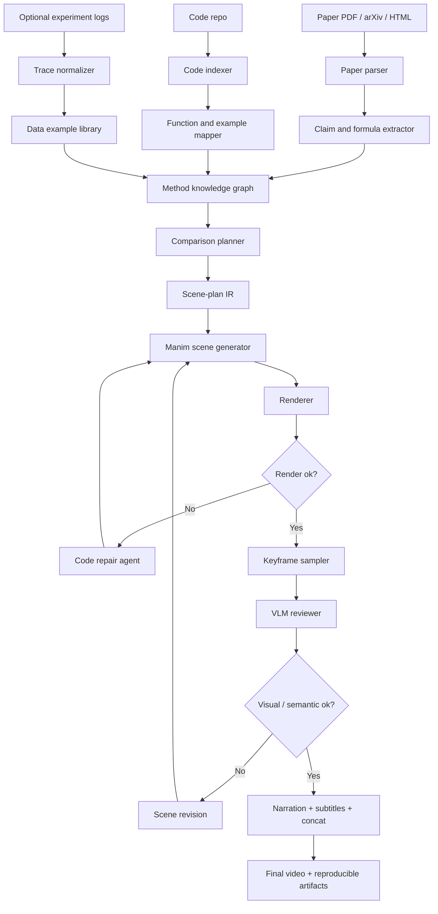

# Paper-with-Code Explainer Video Pipeline

Snapshot date: 2026-07-02.

This plan consolidates the target direction for `4blue2brown`: a repo-level pipeline that can take a paper plus its code repository and produce an explanatory video that combines formulas, code, toy examples, real traces, comparisons to related methods, and paper findings.

## Core Answer: Frame or Animation?

The primary generation unit should be a **scene**, not a single frame.

| Unit | Role in the pipeline | When to generate it |
|---|---|---|
| Frame | Inspection and key visual evidence | Sample rendered scenes for VLM review, layout checks, paper-figure matching, and thumbnails. |
| Static figure | Cheap explanatory asset | Use for early visual prototypes, chart snapshots, formula diagrams, and docs. |
| Scene / animation clip | Main generation target | Generate Manim code for one coherent concept beat, usually 10-60 seconds. |
| Multi-scene video | Final artifact | Concatenate clips with narration, subtitles, transitions, and references. |

For a 3Blue1Brown-like pipeline, the generator should output **scene plans and animation code**. The renderer then produces frames and videos. We should not ask an LLM or image model to generate every frame directly, except for auxiliary bitmap assets. Code is the controllable substrate; frames are evidence.

## Desired Final Product

Given:

- a paper URL or local PDF,
- an associated code repo,
- optional focus questions,
- optional baseline methods to compare,
- optional run traces or experiment logs,

produce:

- a structured explanation plan,
- a formula/code/example alignment map,
- Manim scene code,
- rendered scene clips,
- sampled keyframes,
- VLM review notes,
- narration and subtitles,
- a final video,
- and a reproducible artifact directory.

The ideal user command eventually looks like:

```bash
fourblue2brown generate \
  --paper https://arxiv.org/abs/2605.12380 \
  --code-repo https://github.com/FeynRL-project/FeynRL \
  --focus "P3O / batch-adaptive objective" \
  --compare "PPO,GRPO,CISPO,DPO,SFT" \
  --out runs/feynrl_p3o_explainer
```

## Pipeline Shape



## Artifact Layout

Each generation run should write a full traceable directory:

```text
runs/<run_id>/
  input/
    paper.pdf
    paper_metadata.json
    repo_snapshot.json
  extracted/
    formulas.jsonl
    claims.jsonl
    figures.jsonl
    code_symbols.jsonl
    related_methods.jsonl
  examples/
    toy_examples.jsonl
    trace_examples.jsonl
    comparison_cases.jsonl
  scene_ir/
    outline.yaml
    scenes/
      001_problem_setup.yaml
      002_method_core.yaml
      003_code_walkthrough.yaml
      004_comparison.yaml
      005_findings.yaml
  manim/
    scenes.py
    assets/
  renders/
    clips/
    frames/
  review/
    render_logs.jsonl
    vlm_reviews.jsonl
    repair_history.jsonl
  final/
    narration.md
    subtitles.srt
    video.mp4
```

## Explanation Contract

Every generated video should have at least four aligned channels:

| Channel | What it explains | Example for FeynRL |
|---|---|---|
| Formula | The mathematical object and update rule | ESS, ratio cap, behavioral KL, PPO-style clipping. |
| Code | Where the formula appears in implementation | `algs/P3O/p3o.py::calculate_ess`, `compute_policy_loss`. |
| Example | A small synthetic or real batch | Fresh vs stale policy-ratio distributions. |
| Comparison | What changes vs related methods | PPO/GRPO fixed clip, CISPO detached clipped weight, P3O adaptive cap. |

This is the minimum viable learning unit: formula alone is too abstract, code alone is too local, and data examples alone can hide the method.

## FeynRL First Target

For FeynRL, the first target video should be:

**Working title:** "Why batch staleness breaks fixed clipping, and how ESS adapts the update."

Suggested scenes:

| Scene | Visual content | Source grounding |
|---|---|---|
| 1. RL post-training loop | Policy generates completions, reward scores them, old logprobs are stored, policy updates. | `run_rl_sync.py`, `run_rl_async.py`, `rollouts/replay_buffer.py`. |
| 2. Policy ratio distribution | Fresh ratios cluster near 1; stale replay spreads ratios. | Toy simulator first; later real FeynRL traces. |
| 3. Fixed clipping | PPO/GRPO clip around `[1-eps, 1+eps]`; stale ratios can lose gradient. | `algs/GRPO/grpo.py`, `algs/PPO/ppo.py`. |
| 4. CISPO alternative | Detached clipped ratio still weights score-function gradient. | `algs/CISPO/cispo.py`. |
| 5. P3O core | ESS from the batch sets score cap and `1 - ESS` behavioral KL weight. | `algs/P3O/p3o.py`. |
| 6. Sync vs async systems | Sync stays fresh; async improves throughput but creates off-policy replay. | `run_rl_sync.py`, `run_rl_async.py`, `core/rl_engines.py`. |
| 7. Paper findings | Show reported claim/evidence, then connect back to code and examples. | Paper text, examples, future experiment traces. |

The current lightweight prototype already generates static SVGs for scenes 2, 5, and 6 via:

```bash
python3 tools/feynrl_method_viz.py
```

## Comparison Research Plan

The next research step is to build a comparison layer. It should compare methods at three levels:

| Level | Comparison question | Output |
|---|---|---|
| Objective mechanics | What gradient signal does each method give to a token? | Curves over policy ratio `r`, formula side-by-side, code pointers. |
| Data regime | What happens when data is fresh, mildly stale, or stale? | Ratio histograms, ESS, clipfrac, KL, effective update weights. |
| System mode | What changes under sync vs async rollout/training? | Timeline diagrams, replay age distribution, weight-sync events. |

Initial methods for FeynRL:

| Method | Why include it |
|---|---|
| SFT | Establish supervised token loss and global token normalization. |
| DPO | Preference baseline without rollout generation. |
| PPO | Classic value-model RL baseline with fixed clipping. |
| GRPO | Common LLM RL baseline with group-relative advantages. |
| CISPO | Same family, but different clipping/gradient behavior. |
| P3O | ESS-adaptive method central to the FeynRL explainer. |
| P4O | Optional extension if we want to show behavior/proximal mixture anchors. |

## Paper Findings Visualization Plan

A paper finding should be represented as a structured "claim card":

```yaml
claim_id: feynrl_ess_staleness
paper_section: "Method"
claim: "A batch statistic derived from policy ratios can control both off-policy reliability and trust-region strength."
formula_refs:
  - ess_definition
  - p3o_loss
code_refs:
  - external/FeynRL/algs/P3O/p3o.py:calculate_ess
  - external/FeynRL/algs/P3O/p3o.py:compute_policy_loss
examples:
  - toy_fresh_ratio_batch
  - toy_stale_ratio_batch
visual_beats:
  - ratio_histogram
  - ess_tradeoff_curve
  - update_weight_curve
```

Then the scene planner can ask:

- What formula should be on screen?
- What code lines should be highlighted?
- What toy data makes the mechanism visible?
- What comparison baseline makes the point meaningful?
- What paper result or ablation supports the claim?

## Tools We Need To Create

| Tool | Purpose | Priority |
|---|---|---:|
| `paper_fetch` | Download PDF / arXiv HTML / metadata and cache it. | 1 |
| `paper_parse` | Extract sections, formulas, figures, claims, and references. | 1 |
| `code_index` | Index functions, classes, tests, READMEs, configs, and examples. | 1 |
| `formula_code_mapper` | Link formulas/claims to implementation symbols. | 1 |
| `toy_example_generator` | Generate deterministic synthetic examples for abstract methods. | 1 |
| `trace_exporter` | Export real experiment metrics into JSONL. | 2 |
| `comparison_planner` | Build method comparison scenes and tables. | 2 |
| `scene_ir_validator` | Validate YAML scene plans before code generation. | 2 |
| `manim_adapter` | Convert scene IR into Manim code. | 2 |
| `render_harness` | Render scenes, capture logs, sample keyframes. | 2 |
| `vlm_reviewer` | Check frames for layout, semantic correspondence, and missing objects. | 3 |
| `video_assembler` | Concatenate clips, narration, subtitles, and references. | 3 |

## Repo Consolidation Plan

The repo should become a reproducible paper-to-video tool, not just a pile of notes.

Proposed top-level structure:

```text
4blue2brown/
  fourblue2brown/
    cli.py
    paper/
    code/
    examples/
    ir/
    manim/
    render/
    review/
    assemble/
  docs/
    research/
    plans/
  tools/
    feynrl_method_viz.py
  configs/
    feynrl_p3o.yaml
  runs/
  external/
```

Proposed commands:

```bash
fourblue2brown ingest --paper <url-or-pdf> --code-repo <url-or-path> --out runs/<id>
fourblue2brown plan --run runs/<id> --focus "<question>"
fourblue2brown render --run runs/<id> --scene 003_method_core
fourblue2brown review --run runs/<id>
fourblue2brown assemble --run runs/<id>
fourblue2brown generate --paper <url> --code-repo <url> --focus "<question>"
```

The final `generate` command should call the earlier commands internally but still leave all intermediate artifacts on disk.

## Milestones

| Milestone | Deliverable | Success criterion |
|---|---|---|
| M0: Static method visuals | SVG prototypes for one paper/method | FeynRL SVGs regenerate with one command. |
| M1: Paper/code index | Cached paper metadata + code symbol index | Can answer "where is this formula in code?" for FeynRL. |
| M2: Scene IR | YAML scene plans for FeynRL explainer | Scenes are inspectable before Manim generation. |
| M3: First Manim clip | One rendered clip explaining ESS tradeoff | 10-30 seconds, no narration required. |
| M4: Comparison clip | PPO/GRPO/CISPO/P3O side-by-side | Shows fresh vs stale ratio regimes. |
| M5: Findings clip | Paper claim + result + code + example | A paper finding becomes a visual explanation, not just a citation. |
| M6: One-command rough video | `generate` produces a rough multi-scene video | Includes formula/code/example/comparison channels. |

## Open Design Decisions

| Question | Current leaning |
|---|---|
| ManimGL or Manim Community? | Use Manim Community for new generated scenes unless a 3b1b source requires ManimGL compatibility. |
| SVG first or Manim first? | SVG first for quick math/chart prototypes, then Manim for animation. |
| Real traces first or toy examples first? | Toy examples first; real traces once the exporter exists and Babel jobs are stable. |
| One giant agent or staged deterministic pipeline? | Staged pipeline with deterministic artifacts; use agents for planning, mapping, codegen, repair, and review. |
| Generate frames directly? | No, except sampled review frames and generated bitmap assets. Generate scene code, then render frames/video. |
