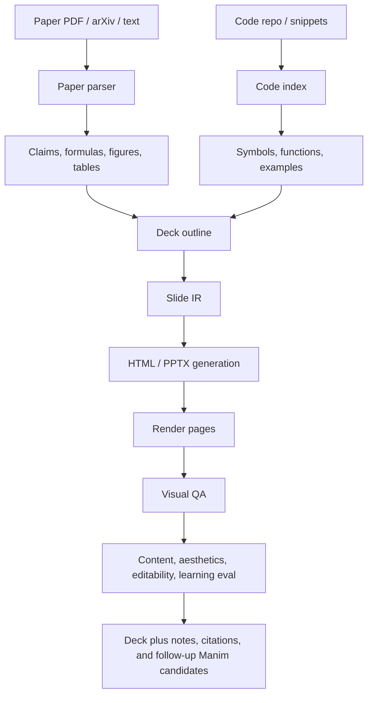

# Auto Slides Generation Landscape

Snapshot date: 2026-07-09.

This note opens the second research track under 4blue2brown: paper/code to
slides. The goal is not to replace the Manim track. The goal is to test whether
slide-generation systems give us useful intermediate artifacts: deck outlines,
editable pages, speaker notes, citation structure, page-level visual QA, and
evaluation metrics that can later feed video generation.

## Why This Track Matters

The Manim track is strong when a concept needs precise motion, geometry, and
rerenderable code. Slides are strong when a paper needs an editable narrative
brief. A slide deck can be inspected page by page, edited by humans, converted
to images for visual metrics, and used as a scaffold for narration.

For our examples, a useful deck should preserve the same four channels as the
video pipeline:

| Channel | Slides version | Example for FeynRL |
|---|---|---|
| Formula | Equations and compact derivation cards | ESS, score cap, behavioral KL |
| Code | Highlighted symbols, function references, snippets | `calculate_ess`, `compute_policy_loss` |
| Example | Toy batch, trace, or simplified table | fresh vs stale policy-ratio batch |
| Comparison | Side-by-side method behavior | PPO, GRPO, CISPO, P3O |

## Candidate Systems

| System | Source | What it contributes | First local test |
|---|---|---|---|
| PPTAgent / DeepPresenter | https://github.com/icip-cas/PPTAgent, https://arxiv.org/abs/2501.03936, https://arxiv.org/abs/2602.22839 | Reference-deck analysis, outline, edit actions, environment-grounded visual reflection, PPTEval. | Short FeynRL prompt, then attach paper/code excerpts. |
| SlideGen | https://github.com/zijyut/SlideGen, https://arxiv.org/abs/2512.04529 | Specialized paper-to-PPTX agents: outliner, mapper, formulizer, arranger, speaker, refiner. | RoPE PDF first, then FeynRL paper/code packet. |
| Paper2Slides | https://github.com/HKUDS/Paper2Slides | RAG, structure extraction, planning, creation, checkpoint/resume, fast preview mode. | FeynRL PDF in fast mode, then normal RAG mode. |
| Paper2Any | https://github.com/OpenDCAI/Paper2Any | Broader paper-to-artifact workspace: Paper2PPT, Paper2Figure, DrawIO, poster, video script. | Inspect Paper2PPT workflow and test editable deck path if public code is enough. |
| SlideTailor | https://github.com/nusnlp/SlideTailor, https://arxiv.org/abs/2512.20292 | Personalized paper-to-slides from a paper-slides example pair and visual template; chain-of-speech for narration alignment. | Use as reference for style/template conditioning after baseline runs. |
| AutoPresent / SlidesBench | https://arxiv.org/abs/2501.00912 | Programmatic slide generation and iterative design refinement; useful as a substrate lesson. | Compare against our own HTML/PPTX slide IR sketch. |
| ppt-agent-skills | https://github.com/sunbigfly/ppt-agent-skills | Skill/state-machine approach: research, outline, style, planning, HTML, visual QA, PPTX export. | Mine pipeline ideas; maybe run as a skill if dependency shape fits. |
| opengamma | https://github.com/gammacodehq/opengamma | Minimal text-to-python-pptx agent, success-rate experiments. | Keep as low-complexity baseline only. |

## Evaluation References

| Benchmark | Source | Useful signal |
|---|---|---|
| SlidesGen-Bench | https://github.com/YunqiaoYang/SlidesGen-Bench, https://arxiv.org/abs/2601.09487 | Unified visual-domain evaluation with content, aesthetics, and editability. |
| PPTC | https://github.com/gydpku/PPTC, https://arxiv.org/abs/2311.01767 | PowerPoint task completion, multi-turn editing, PPTX-Match evaluation. |
| DynaSlide / SlideAgent | https://github.com/XiaoZhou2024/SlideAgent, https://arxiv.org/abs/2604.17894 | Bring-your-own-template slide updates while preserving layout and style. |
| PresentBench | https://arxiv.org/abs/2603.07244 | Fine-grained rubric-based evaluation for generated decks. |

## Normalized Pipeline

## Local Smoke Test

The first local artifact is intentionally small:

- Input: the existing FeynRL / P3O ESS example.
- Output: `progress_site/assets/slides-smoke/feynrl_p3o_deck.html`.
- Contact sheet: `progress_site/assets/slides-smoke/feynrl_p3o_deck.svg`.
- Claim status: local slide-IR sketch, not an upstream SlideGen, PPTAgent, or
  Paper2Slides output.

This gives the website an evidence slot and makes the test shape concrete:
each future upstream run should replace or sit beside this contact sheet.

## Test Matrix

| Candidate | Initial input | Required environment | Judge first |
|---|---|---|---|
| Local slide-IR sketch | FeynRL / P3O notes | none beyond static site | Narrative shape, density, formula/code/example coverage. |
| SlideGen | RoPE paper PDF, then FeynRL | OpenAI key, LibreOffice, custom `python-pptx` fork, PDF parsing deps | Figure/formula mapping, speaker notes, editable PPTX. |
| PPTAgent / DeepPresenter | FeynRL brief plus source attachments | `uvx pptagent`, config, optional Docker/model setup | Edit action reliability, visual repair, PPTEval dimensions. |
| Paper2Slides | FeynRL PDF | Python 3.12 env, API keys, image provider config | RAG quality, extracted figures/tables, style control. |
| SlidesGen-Bench | Generated decks | LibreOffice conversion, OCR/layout model setup | Content, aesthetics, editability metrics for our outputs. |

## Immediate Next Steps

1. Add one upstream quick run for SlideGen or Paper2Slides on RoPE, because RoPE
   already has a strong Manim comparison set.
2. Convert the output deck into page images and contact sheets.
3. Add those assets beside the local smoke test in the website.
4. Run a small SlidesGen-Bench subset only after at least two real generated
   decks exist.
5. Feed the strongest deck outline back into the Manim Scene IR planner.
