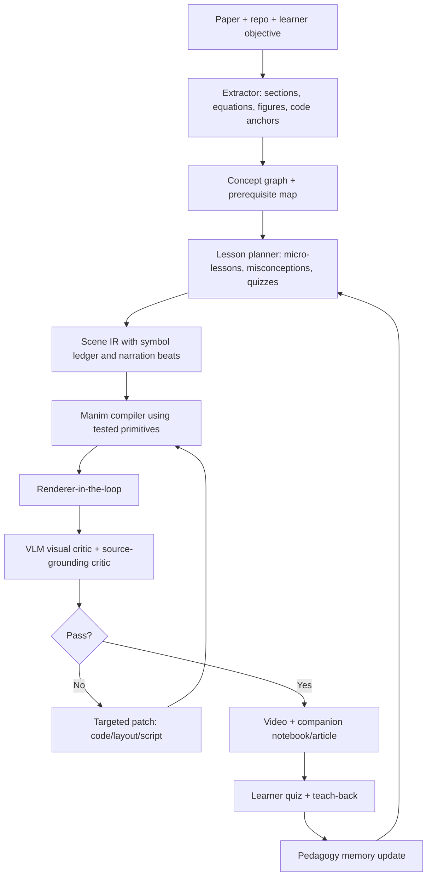

# Deep research: math formula and paper/concept explainer frameworks

Date: 2026-07-02

This note surveys existing work around two related goals:

1. explaining math formulas and mathematical mechanisms;
2. explaining papers, concepts, and algorithms through generated visual presentations or videos.

The important framing for our project is educational, not just generative. The goal is not "turn a paper into a video-shaped artifact"; the goal is "help a specific learner build a usable mental model of a paper, with formulas, code, examples, figures, and data connected in time."

## Executive summary

There is now a recognizable wave of systems that look close to what we want:

- LLM-to-Manim systems generate programmatic STEM animations from text, theorem statements, or paper sections.
- Paper-to-video systems generate slide decks, narration, subtitles, and sometimes a talking head from papers.
- Code-centric educational video systems explicitly argue that pixel-space video generation is weak for symbolic education, and use executable code, usually Manim, as the controllable substrate.
- Formula accessibility systems parse, verbalize, and semantically enrich mathematical expressions, which is a different but useful foundation for explaining formulas.
- Community feedback is skeptical of "AI reads slides" outputs; people want figure walkthroughs, pacing, storytelling, and conceptual digestion.

The best current recipe is converging on:

```text
paper/code input
-> structured extraction
-> concept/storyboard planning
-> scene-level executable code generation
-> render loop
-> VLM or human critique
-> targeted repair
-> educational evaluation
```

But the gap remains large. Current systems are much better at creating a plausible presentation than at making a learner actually understand a hard technical paper. For our project, the promising direction is a learner-centered, code-grounded Manim pipeline:

```text
paper + repo + learner state
-> concept dependency graph
-> symbol ledger + code anchors + data examples
-> micro-lessons with prerequisites and misconceptions
-> Manim scenes
-> multimodal critique
-> pre/post quiz and teach-back loop
```

## Taxonomy of existing approaches

| School | Core idea | Representative systems | What it solves | Main weakness |
|---|---|---|---|---|
| Formula rendering and accessibility | Convert formula markup into display, speech, semantic trees, or canonical forms | MathJax, Speech Rule Engine, LaTeXML, MathBridge, Speech-to-LaTeX | Formula presentation, speech, accessibility, parsing | Does not decide how to teach the concept |
| Manual/programmatic animation libraries | Human writes Manim or domain-specific animation code | Manim, 3Blue1Brown repos, ManimML | Precise symbolic animation, reproducibility, reusable visual primitives | High authoring cost, needs taste and pedagogy |
| LLM-to-Manim explainer agents | LLM plans scenes and generates Manim code, with render/debug loops | Manimator, TheoremExplainAgent, LLM2Manim, ManimTrainer, ManimAgent, Paper2Manim | Automates scene/code generation; can use renderer and VLM feedback | Layout, correctness, pacing, and pedagogy remain brittle |
| Code-centric educational video generation | Treat code as the substrate for educational video instead of pixel video | Code2Video | Strong control, structured eval, VLM critic, Manim benchmark | Still topic-to-video, not necessarily paper+code grounded |
| Paper-to-presentation/video | Convert paper into slides, narration, subtitles, avatar/talker, videos | Paper2Video/PaperTalker, DOC2PPT, PPTAgent, Auto-Slides, Paper2Poster | Paper ingestion, asset extraction, layout, presentation eval | Often becomes slide summarization rather than conceptual construction |
| Figure-to-video | Explain one scientific figure with paper-grounded narration and region highlights | MINARD/FigTalk | Good for walking through dense architecture/results figures | Does not animate formulas/code/data dynamics by itself |
| Interactive/whiteboard explainers | Interactive or whiteboard-style generation with narration | Community tools such as Magnetron.ai mentioned in HN discussion | More engaging than slide reading; can adapt pacing | Often product/prototype oriented and less reproducible/auditable |

## Work-by-work notes

### 1. Formula rendering, speech, and semantic parsing

**MathJax**

- Source: https://www.mathjax.org/
- Docs: https://docs.mathjax.org/en/latest/basic/accessibility.html
- Role: browser/server math rendering from TeX, MathML, or AsciiMath into HTML/CSS, SVG, or MathML.
- Useful features for us:
  - high-quality formula rendering;
  - copy/reuse formula source;
  - accessibility extensions for speech, expression exploration, highlighting, and Braille;
  - server-side workflows.
- What it teaches us: formula display and formula explanation should be separated. Rendering `ESS = (sum w)^2 / (n sum w^2)` is not the same as explaining why squared weights penalize ratio spread.

**Speech Rule Engine (SRE)**

- Source: https://github.com/Speech-Rule-Engine/speech-rule-engine
- Role: translate MathML/XML expressions into speech strings, semantic trees, enriched MathML, and auditory descriptions.
- It has rule sets for MathSpeak and ClearSpeak, localization, semantic reconstruction, and Braille output.
- Useful for us:
  - formula-to-speech baseline;
  - semantic tree extraction;
  - symbol-level navigation and highlighting;
  - detecting when generated narration mismatches formula structure.
- Limitation: SRE can read formulas, but does not decide the pedagogical path through an algorithm.

**LaTeXML**

- Source: https://dlmf.nist.gov/LaTeXML/
- Role: convert LaTeX documents into XML/HTML/MathML while preserving more structure than plain PDF parsing.
- Useful for us:
  - arXiv source ingestion;
  - section/equation extraction;
  - formula identities that can be referenced in scene IR.
- Limitation: parsing structure is not enough. We still need concept dependency extraction and grounding to code/data.

**MathBridge and Speech-to-LaTeX**

- MathBridge: https://arxiv.org/abs/2408.07081
- Speech-to-LaTeX: https://arxiv.org/abs/2508.03542
- Role: convert spoken mathematical expressions into LaTeX or benchmark speech-based math recognition.
- Relevance:
  - if our pipeline adds voice input, lecture transcription, or generated subtitles, math speech normalization matters;
  - it also helps build a "narration <-> formula" alignment layer.
- Limitation: this is about notation conversion, not conceptual explanation.

**Takeaway for us**

Use these as infrastructure:

- normalize formulas;
- create a symbol ledger;
- generate first-pass speech;
- align spoken words to formula subexpressions;
- support formula highlighting in Manim.

Do not expect them to solve the teaching problem.

### 2. Manual and domain-specific Manim libraries

**Manim / 3Blue1Brown source style**

- 3Blue1Brown source/org survey in this repo:
  - [3b1b-github-survey.md](./3b1b-github-survey.md)
  - [3b1b-direct-source-cases.md](./3b1b-direct-source-cases.md)
- Role: programmatic animation DSL with deterministic object transforms.
- Why it matters:
  - exact control over formulas, shapes, timing, camera, morphs;
  - editable source code;
  - reproducible renders;
  - ideal target language for code-generation agents.
- Weakness:
  - human skill is doing most of the work: concept selection, pacing, diagrams, metaphors, voiceover, simplification.

**ManimML**

- Paper: https://arxiv.org/abs/2306.17108
- GitHub: https://github.com/helblazer811/ManimML
- Role: a Manim extension for ML architecture animations using PyTorch-like layer specifications.
- Key idea: experts should write a compact domain-specific specification, then the library composes common animations.
- Relevance to us:
  - do not ask LLMs to invent every visual primitive from scratch;
  - build domain-specific primitives for RL algorithms, optimizers, replay buffers, loss terms, ratio distributions, KL terms, and training traces.
- Gap:
  - ManimML targets neural network architecture/forward-pass visualization, not paper comprehension across formulas, code, and empirical findings.

**Takeaway for us**

For FeynRL-like papers, we should create a small "RL explainer primitive library" on top of Manim:

- policy/reward/replay/training loop blocks;
- ratio distribution and ESS widgets;
- loss-term decomposition widgets;
- code-line highlighting widgets;
- data trace plot widgets;
- compare-method curve widgets.

This reduces long-horizon generation difficulty. The LLM should compose tested components, not hand-place every rectangle forever.

### 3. LLM-to-Manim and agentic animation generation

**Manimator**

- Paper: https://arxiv.org/abs/2507.14306
- Role: open-source system that transforms research papers or prompts into Manim animations.
- Pipeline shape:
  - interpret text/PDF;
  - generate structured scene description;
  - translate scene description into executable Manim code.
- Useful idea:
  - separate semantic scene description from Manim code.
- Likely weakness:
  - early-stage system; little evidence of learner outcomes;
  - explanation quality depends heavily on prompt and model taste.

**TheoremExplainAgent**

- Paper: https://arxiv.org/abs/2502.19400
- Role: agentic generation of long-form theorem explanation videos, over 5 minutes, using Manim.
- Benchmark: TheoremExplainBench with 240 theorems and automated metrics.
- Reported result: an o3-mini agent achieved high render/task success, but the paper still notes layout issues in generated videos.
- Useful idea:
  - long-form explanation requires agentic planning;
  - multimodal explanations reveal reasoning flaws that may be hidden in text-only explanations.
- Relevance:
  - for FeynRL, a text summary can look right while the visual explanation exposes missing causal steps.

**LLM2Manim**

- Paper: https://arxiv.org/abs/2604.05266
- Role: pedagogy-aware LLM + Manim pipeline for narrated STEM animations.
- Core mechanisms:
  - concept brief -> scene plan -> Manim code -> render/narration sync -> delivery;
  - constrained prompt templates;
  - symbol ledger;
  - partial regeneration when a part breaks;
  - human-in-the-loop review;
  - multimedia-learning ideas such as segmentation, signaling, dual coding, and temporal contiguity.
- Evaluation:
  - 100-student within-subject A/B study comparing animations with PowerPoint slides;
  - reported better post-test scores, higher learning gains, higher engagement, and lower cognitive load.
- Why this is important:
  - it treats the task as an education problem, not just a generation problem;
  - it evaluates learners, not only artifacts.
- Weakness:
  - still semi-automated;
  - depends on expert review;
  - not specifically paper+code grounded.

**ManimTrainer / ManimAgent**

- Paper: https://arxiv.org/abs/2604.18364
- Role: systematic training and inference study for Manim animation generation.
- Key components:
  - SFT and GRPO for training;
  - renderer-in-the-loop inference;
  - API-doc augmented renderer-in-the-loop;
  - unified reward signal combining code and visual assessment.
- Evaluation:
  - 17 open-source sub-30B models;
  - ManimBench;
  - metrics such as Render Success Rate and Visual Similarity.
- Reported headline:
  - Qwen 3 Coder 30B with GRPO and RITL-DOC reached high render success and visual similarity, surpassing a GPT-4.1 baseline on visual similarity in their setup.
- Lesson:
  - backbone matters, but environment feedback matters more than raw prompting;
  - pure code metrics and visual metrics can diverge.

**ManimAgent / Paper2Manim**

- Project page: https://manimagent.github.io/
- Paper: https://arxiv.org/abs/2606.30296
- GitHub: https://github.com/jwj1342/Paper2Manim
- Role: self-evolving multimodal agent for visual education, with cross-task memory.
- Pipeline:
  - Storyboarder;
  - Coder;
  - Renderer;
  - text reviewer;
  - VLM reviewer;
  - visual reviser;
  - dual-channel episodic memory bank.
- Memory idea:
  - positive channel stores successful rationales;
  - negative channel stores validated failure patterns.
- Project README claims staged MVPs:
  - text -> single scene;
  - arXiv/PDF -> 2-5 scene video;
  - render frames -> VLM review -> visual revise;
  - episodic memory/RAG for cross-paper improvement.
- Reported project-page results:
  - human Pass@1 improves as memory grows;
  - reflection rounds decrease;
  - human quality improves.
- Relevance:
  - very close to our desired architecture;
  - their separation of storyboard, code, render, visual review, trace logs, and memory is directly useful.
- Gap:
  - the memory is mostly about generation failures and visual lessons;
  - it does not fully solve learner modeling, code/data grounding, or "did Colin understand FeynRL?"

**Takeaway for us**

Adopt:

- scene IR before code;
- symbol ledger;
- renderer-in-the-loop;
- VLM keyframe/video critique;
- trace logs;
- per-scene retries;
- memory of visual and pedagogical failures.

Extend:

- add source-code anchors;
- add runnable data examples;
- add learner quiz/teach-back;
- add "misconception checks" before scene generation.

### 4. Code-centric educational video generation

**Code2Video**

- Paper: https://arxiv.org/abs/2510.01174
- GitHub: https://github.com/showlab/Code2Video
- Role: agentic, code-centric framework for educational videos, accepted to ICML 2026 according to the GitHub README.
- Core argument:
  - pixel-space text-to-video is weak for educational videos because symbolic layout, transitions, and long-horizon reasoning need precise control;
  - executable code is more interpretable, controllable, and auditable.
- Pipeline:
  - Planner: structure lecture content into coherent sections and prepare assets;
  - Coder: generate executable Manim code with scope-guided auto-fix;
  - Critic: use VLM feedback and visual anchor prompts for layout refinement.
- Important engineering idea:
  - discretize canvas into visual anchors and maintain occupancy tables so the critic can make actionable layout edits.
- Benchmark:
  - MMMC, based on professionally produced 3Blue1Brown-style topics;
  - 117 curated learning topics and 339 timestamp-based subclips, according to the paper.
- Evaluation:
  - VLM-as-judge for element layout, attractiveness, logic flow, visual consistency, accuracy/depth;
  - code efficiency;
  - TeachQuiz, measuring whether a model can answer concept questions after watching the video relative to a controlled baseline.
- Relevance:
  - this is the cleanest argument for Manim-first rather than pixel video;
  - TeachQuiz is the right kind of evaluation direction for us.
- Gap:
  - concept-to-video, not necessarily paper+repo-to-video;
  - not necessarily personalized to a learner;
  - VLM-as-student is useful but not a substitute for human learning.

**Takeaway for us**

We should implement an anchor-grid/occupancy layer early. Many LLM-generated Manim failures are spatial, not conceptual. If our scene IR has anchors and bounding boxes, VLM feedback becomes much more patchable.

### 5. Paper-to-video, paper-to-slide, and paper-to-poster systems

**Paper2Video / PaperTalker**

- Paper: https://arxiv.org/abs/2510.05096
- GitHub: https://github.com/showlab/Paper2Video
- Role: automatic presentation video generation from scientific papers.
- Pipeline:
  - slide generation;
  - layout refinement;
  - cursor grounding;
  - subtitles;
  - speech synthesis;
  - talking-head rendering;
  - slide-wise parallel generation.
- Dataset/benchmark:
  - 101 research papers paired with author-created presentation videos, slides, and speaker metadata.
- Metrics:
  - Meta Similarity;
  - PresentArena;
  - PresentQuiz;
  - IP Memory.
- Relevance:
  - strong for paper asset extraction and presentation-video construction;
  - their metrics are useful for paper-faithfulness and information coverage.
- Gap:
  - community feedback on Hacker News highlights the core weakness: if it becomes "text on slides plus voice," it does not explain the paper. Several comments specifically wanted better figure explanation, better pacing, and less slide-reading behavior.

**DOC2PPT**

- Paper: https://arxiv.org/abs/2101.11796
- Role: early document-to-slide generation from scientific documents.
- Pipeline includes summarization, image/text retrieval, slide structure, and layout prediction.
- Relevance:
  - paper-to-slide is an older formulation of our problem;
  - useful for content compression and layout.
- Gap:
  - slides are not animations;
  - no strong learner-centered evaluation.

**PPTAgent**

- Paper: https://arxiv.org/abs/2501.03936
- GitHub: https://github.com/icip-cas/PPTAgent
- Role: presentation generation with a two-stage edit-based process inspired by human slide workflows.
- Evaluation:
  - PPTEval across content, design, and coherence.
- Relevance:
  - edit-based workflows are more robust than one-shot generation;
  - reference-style extraction can stabilize design.

**Auto-Slides**

- Paper: https://arxiv.org/abs/2509.11062
- Role: interactive multi-agent system for research-paper presentations.
- Education angle:
  - pedagogically structured slides;
  - diagrams/tables;
  - learner knowledge level and goals;
  - iterative refinement through an editor;
  - verification and retrieval.
- Relevance:
  - close to "educate me on this paper";
  - personalization matters.
- Gap:
  - slide medium, not Manim animation;
  - less focused on formula/code/data dynamics.

**Paper2Poster**

- Paper: https://arxiv.org/abs/2505.21497
- GitHub: https://github.com/Paper2Poster/Paper2Poster
- Role: convert scientific papers into editable `.pptx` posters.
- Pipeline:
  - Parser distills paper into asset library;
  - Planner builds a binary-tree layout;
  - Painter-Commenter loop renders and uses VLM feedback to remove overflow and improve alignment.
- Evaluation:
  - visual quality;
  - textual coherence;
  - holistic VLM assessment;
  - PaperQuiz for core-content transfer.
- Relevance:
  - asset library and Painter-Commenter loops are very useful;
  - PaperQuiz resembles the evaluation we need.

**Takeaway for us**

Paper-to-slide/poster/video systems solve a lot of boring but important engineering:

- parse paper;
- extract figures/tables/equations;
- summarize sections;
- choose assets;
- layout content;
- evaluate faithfulness and information retention.

But for "I want to understand this algorithm," slide generation is not enough. Our pipeline needs a lower-level explanatory substrate: formulas moving, toy examples, code highlights, and data traces.

### 6. Figure-to-video systems

**MINARD / FigTalk**

- Paper: https://arxiv.org/abs/2606.12576
- Role: generate narrated, region-grounded walkthrough videos from a scientific figure and its paper.
- Core idea:
  - decompose complex figure regions;
  - generate paper-grounded narration;
  - sequentially ground narration to figure regions.
- Relevance:
  - many ML/RL papers encode the algorithm in a single dense diagram;
  - a figure walkthrough is often the first bridge from paper text to intuition.
- Gap:
  - figure-region explanation is not the same as animating the algorithm's state changes, equations, code, and data.

**Takeaway for us**

We should have a `figure_walkthrough` scene type:

- import a paper figure;
- segment/label regions;
- animate highlights;
- link regions to equations, code files, and data examples;
- then transition into a custom Manim reconstruction.

This is especially useful before replacing a static figure with a clean 3Blue1Brown-style abstraction.

## What the forums/community signal says

The most useful community signal I found is the Hacker News thread for Paper2Video:

- Link: https://news.ycombinator.com/item?id=45553701
- Repeated concerns:
  - presentation videos can degrade into slide reading;
  - figures are where many paper presentations succeed or fail;
  - dense tiny text is a common failure;
  - natural narration and pacing matter;
  - TTS prosody issues are noticeable;
  - some people prefer articles over videos, so the medium should be optional.
- Positive signal:
  - people see access value if the system actually improves science communication;
  - feedback loops for layout and non-verbatim narration are seen as promising.

Implication: our output should not be a conference-talk simulator. It should be closer to a study tutor:

- fewer claims per scene;
- more visual causality;
- explicit "why this term exists";
- examples that can be computed;
- self-check questions;
- optional article/notebook output in parallel.

## Motivation patterns across the literature

Across these systems, the motivation is surprisingly consistent:

1. Manual educational animation is expensive.
2. Papers are dense, multimodal, and hard to self-study.
3. Pixel video generation is poorly suited to symbols, small text, diagrams, and long logical dependencies.
4. Code-generated video is controllable, editable, reproducible, and inspectable.
5. Evaluation must go beyond visual appeal toward knowledge transfer.
6. LLMs can generate plausible scripts/code, but need planning, rendering feedback, visual critique, and often human review.

For our project, the central motivation should be:

> A paper is not a video script. A paper is an evidence artifact. To educate a learner, we need to transform that artifact into a sequence of mental-model updates, each grounded in formulas, source code, data, and examples.

## Challenges that keep appearing

| Challenge | Why it matters | Existing tactic | What we should add |
|---|---|---|---|
| Content selection | Papers contain too many claims | Summarizer, planner, storyboard | Learner-specific objective and prerequisite map |
| Formula semantics | Same formula can be rendered without being understood | MathML/SRE/symbol ledger | Formula-to-toy-example mapping |
| Visual layout | LLM code often overlaps text/objects | VLM critic, anchors, occupancy table | Scene IR with constraints and automatic visual tests |
| Temporal coherence | Long videos drift | scene decomposition, subclips, outline | concept dependency graph and recap links |
| Code correctness | Generated Manim may not render | renderer-in-the-loop, scope repair | tested primitives and per-scene contracts |
| Pedagogical quality | Accurate summary can still be incomprehensible | CTML/CLT, segmentation, signaling | misconceptions, pre/post quiz, teach-back |
| Paper faithfulness | LLM may invent or omit claims | retrieval, source citations, figure grounding | code/data anchors and claim provenance |
| Voice/visual sync | Good visuals fail if narration drifts | timing markers, subtitles | narration event schema tied to animations |
| Evaluation | Aesthetic score is not learning | TeachQuiz, PresentQuiz, PaperQuiz, human studies | learner-specific quizzes and delayed recall |
| Reusability | One-off generated scenes are hard to improve | episodic memory/RAG | memory split into visual failures, pedagogy failures, domain primitives |

## Evaluation: what exists and what we should borrow

### Existing eval styles

| Eval style | Used by | What it measures | Strength | Weakness |
|---|---|---|---|---|
| Render Success Rate | ManimTrainer, agentic Manim systems | Does the code render? | Necessary reliability metric | Says nothing about teaching |
| Visual Similarity | ManimTrainer | Similarity to reference videos | Useful for benchmarked tasks | Can reward copying surface style |
| VLM-as-judge aesthetics | Code2Video, Paper2Poster | Layout, attractiveness, logic flow, consistency, accuracy/depth | Cheap, scalable | VLM judgment can be biased or shallow |
| Human Pass@1 / quality | ManimAgent | Human-rated first-try usefulness and quality | More grounded | Expensive and subjective |
| TeachQuiz | Code2Video | Knowledge transfer from video to model | Directly educational | Model-student is not a human learner |
| PresentQuiz/IP Memory | Paper2Video | Paper information retained from generated presentation | Paper-faithfulness oriented | May still miss deep intuition |
| PaperQuiz | Paper2Poster | Whether poster conveys core paper content | Good for compression | Static medium |
| Classroom A/B study | LLM2Manim | Real learner outcomes | Best evidence | Expensive, topic-dependent |

### Our eval stack

We should layer evaluation:

1. **Build reliability**
   - Manim render success;
   - no overlap/overflow by screenshot checks;
   - scene duration and audio/subtitle sync;
   - deterministic reproducibility manifest.

2. **Grounding**
   - each claim maps to paper section/equation/figure/code line;
   - each visualized variable appears in the symbol ledger;
   - code examples execute or are marked illustrative.

3. **Educational usefulness**
   - pre-quiz before watching;
   - post-quiz after watching;
   - "teach-back" prompt: learner explains the method back;
   - misconception checklist;
   - delayed recall if we ever build a study loop.

4. **Video quality**
   - VLM keyframe review;
   - human quick-review rubric;
   - pacing score: one core idea per scene;
   - "can I explain this frame without the paper?" check.

## Backbone/model differences

Existing work suggests model choice matters, but pipeline structure matters more.

### Code model

For Manim generation, strong code models matter because the task is executable Python plus spatial API use. ManimTrainer reports large differences across models and shows that SFT/GRPO plus renderer-in-the-loop can beat plain prompting. Code-specialized open-source models can become competitive if trained or wrapped correctly.

What matters most:

- Manim API knowledge;
- ability to maintain scene state and object references;
- debugging from stack traces;
- following layout constraints;
- generating small, repairable code.

### VLM critic

VLMs are useful for spotting:

- overlap;
- missing or tiny text;
- poor visual hierarchy;
- mismatched narration/visual;
- unhelpful figure walkthroughs.

But VLMs are still weak at continuous spatial correction. Code2Video's anchor grid is important because it converts "move this away" into discrete coordinates.

### Long-context model

Paper understanding needs long context and retrieval:

- arXiv source;
- paper PDF;
- code repo;
- equations;
- experiments;
- related work.

But long context alone is dangerous. It can summarize everything and teach nothing. We need structured extraction and a concept graph.

### Reasoning model

Reasoning models are valuable for:

- deriving toy examples;
- explaining why a loss term exists;
- mapping formula to code;
- proposing counterexamples;
- detecting conceptual jumps.

But they still need grounding against paper/code, because plausible algorithm explanations can be subtly wrong.

### TTS/audio model

Paper2Video community feedback shows that prosody and pacing are very noticeable. A video with good slides and unnatural speech can still feel bad. We should treat voice as part of the educational design, not just a final render step.

## What current systems can and cannot do

### They can do

- parse papers into sections, summaries, assets;
- generate slide-like presentations;
- produce Manim code from concepts;
- render short to medium educational animations;
- use VLM feedback to catch layout problems;
- evaluate with artifact metrics and quiz-like proxies;
- demonstrate improvements over one-shot baselines.

### They cannot reliably do yet

- guarantee mathematical correctness;
- guarantee paper faithfulness at the claim level;
- generate 3Blue1Brown-quality explanations autonomously;
- know which explanation will make a particular learner understand;
- integrate paper, code, data, formulas, and experiments into one coherent learning arc;
- use learner feedback to adapt the next scene;
- evaluate deep understanding rather than immediate recognition;
- maintain long-horizon narrative quality over 10-30 minutes without human taste.

## Implications for our FeynRL explainer direction

The video we generated earlier failed pedagogically because it was a pipeline smoke test:

- it showed terms before explaining them;
- it assumed the viewer already knew RL post-training, policy ratios, ESS, clipping, and KL;
- it had no narration;
- it did not use a toy numeric example;
- it was a recap, not a lesson.

The research above says the fix is not "add more scenes." The fix is to change the formation.

### Recommended formation

```text
1. Learner objective
   - What does Colin want to understand?
   - What prerequisites are assumed?
   - What should he be able to explain after the video?

2. Paper/repo ingestion
   - paper sections, equations, figures, tables
   - repo files, code anchors, config/examples
   - runnable or synthetic traces

3. Concept dependency graph
   - stale replay
   - policy ratio
   - importance weight
   - ESS
   - clipping/capping
   - KL penalty
   - sync vs async data regime
   - comparison to PPO/GRPO/CISPO

4. Scene IR
   - scene goal
   - misconception addressed
   - formula symbols
   - code anchors
   - visual primitives
   - narration beats
   - expected quiz item

5. Manim generation
   - compose tested primitives
   - generate only glue code and custom local visuals
   - render per scene

6. Critique and repair
   - stack trace repair
   - visual overlap/legibility review
   - VLM semantic review
   - source-grounding review

7. Learning eval
   - pre-question
   - post-question
   - learner teach-back
   - revise confusing scene
```

### Scene types we should support

| Scene type | Purpose | Example for FeynRL |
|---|---|---|
| Concept hook | Establish why a problem matters | Same token gets very different probability under old/new policy |
| Toy numeric example | Make formula necessary | Show ratio weights and ESS calculation on 5 samples |
| Formula walk | Explain each term | Why `(sum w)^2 / sum w^2` drops when weights spread |
| Code anchor | Show implementation | Highlight `old_logprobs`, `ratio`, `calculate_ess`, loss composition |
| Data trace | Show empirical behavior | Plot fresh vs stale ratio distributions from real/synthetic traces |
| Method comparison | Place in literature | PPO/GRPO fixed clipping vs P3O adaptive ESS cap |
| Figure walkthrough | Explain paper diagram | Highlight algorithm loop regions, then reconstruct cleanly |
| Finding visualization | Explain result | Turn table/plot into story: throughput vs policy lag vs stability |
| Self-check | Test understanding | Ask what happens if one ratio is huge |

## Concrete design recommendations for this repo

### 1. Use Manim as the primary target, but not raw Manim everywhere

Raw Manim code generation is too brittle. Build a small internal DSL:

```text
ConceptCard(...)
FormulaLedger(...)
RatioHistogram(...)
ESSGauge(...)
PolicyReplayLoop(...)
CodeHighlight(...)
MethodCurveComparison(...)
PaperFigureWalkthrough(...)
```

Then let the agent assemble these.

### 2. Introduce a scene IR

A scene should be stored as JSON/YAML before Manim:

```yaml
scene_id: ess_toy_example
learning_goal: Understand why ESS drops when policy ratios are uneven.
prerequisites:
  - probability ratio
  - weighted average intuition
symbols:
  w_i: policy ratio for sample i
  n: number of samples
paper_refs:
  - equation: ESS definition
code_refs:
  - external/FeynRL/algs/P3O/p3o.py:calculate_ess
visuals:
  - type: ratio_bars
  - type: formula_walk
narration:
  - beat: "Start with five samples..."
quiz:
  question: "If one weight becomes huge, does ESS go up or down?"
```

### 3. Maintain separate memories

Do not mix all memories into one RAG soup.

- Visual memory: layout failures, font sizing, Manim API gotchas.
- Pedagogy memory: explanations that helped, misconceptions, good toy examples.
- Domain memory: RL primitives, algorithms, formulas.
- Source memory: paper/code anchors and claim provenance.

### 4. Treat quiz generation as first-class

Every scene should have a quiz item before code generation. If we cannot ask a question that checks the scene's point, the scene probably does not have a point.

### 5. Build article/notebook output alongside video

Some learners prefer text. Also, text is easier to verify. The video should have a companion:

- formula derivation;
- code pointers;
- generated figures;
- scene transcript;
- quiz answers.

This also gives the agent a grounding artifact before it tries to animate.

## Proposed pipeline v0.2



## High-priority next experiments

1. **One concept only: ESS from five samples**
   - Input: tiny ratio list, formula, code anchor.
   - Output: 60-90 second Manim video.
   - Eval: can the learner predict what happens when one ratio explodes?

2. **Paper figure walkthrough**
   - Input: FeynRL method figure or our reconstructed method diagram.
   - Output: region-grounded narration plus Manim reconstruction.
   - Eval: can the learner identify where stale replay enters?

3. **Formula-code alignment**
   - Input: P3O equation and `calculate_ess` / loss code.
   - Output: side-by-side formula/code animation.
   - Eval: can the learner map `old_logprobs -> ratio -> ess_factor -> rho -> loss`?

4. **Comparison scene**
   - Input: PPO/GRPO/CISPO/P3O objective snippets.
   - Output: visually aligned curves and update behavior.
   - Eval: can the learner explain what is fixed vs adaptive?

## Source index

### Directly related to Manim/video generation

- LLM2Manim: https://arxiv.org/abs/2604.05266
- Code2Video: https://arxiv.org/abs/2510.01174
- Code2Video GitHub: https://github.com/showlab/Code2Video
- Manimator: https://arxiv.org/abs/2507.14306
- TheoremExplainAgent: https://arxiv.org/abs/2502.19400
- ManimTrainer: https://arxiv.org/abs/2604.18364
- ManimAgent: https://arxiv.org/abs/2606.30296
- ManimAgent project page: https://manimagent.github.io/
- Paper2Manim GitHub: https://github.com/jwj1342/Paper2Manim
- ManimML: https://arxiv.org/abs/2306.17108
- ManimML GitHub: https://github.com/helblazer811/ManimML

### Paper/presentation/figure transformation

- Paper2Video: https://arxiv.org/abs/2510.05096
- Paper2Video GitHub: https://github.com/showlab/Paper2Video
- MINARD / FigTalk: https://arxiv.org/abs/2606.12576
- Paper2Poster: https://arxiv.org/abs/2505.21497
- Paper2Poster GitHub: https://github.com/Paper2Poster/Paper2Poster
- PPTAgent: https://arxiv.org/abs/2501.03936
- PPTAgent GitHub: https://github.com/icip-cas/PPTAgent
- Auto-Slides: https://arxiv.org/abs/2509.11062
- DOC2PPT: https://arxiv.org/abs/2101.11796

### Formula parsing, speech, and accessibility

- MathJax: https://www.mathjax.org/
- MathJax accessibility docs: https://docs.mathjax.org/en/latest/basic/accessibility.html
- Speech Rule Engine: https://github.com/Speech-Rule-Engine/speech-rule-engine
- LaTeXML: https://dlmf.nist.gov/LaTeXML/
- MathBridge: https://arxiv.org/abs/2408.07081
- Speech-to-LaTeX: https://arxiv.org/abs/2508.03542

### Community discussion

- Hacker News discussion of Paper2Video: https://news.ycombinator.com/item?id=45553701
